> **DERIVED COPY — NON CANONICAL**
> Documento sorgente: TRAMA_Product_Architecture_CX_Handbook_Draft_1.2_Referral_Incentives.docx
> Versione: Draft 1.2 (16 luglio 2026 — Referral incentives e Partner Trust alignment) — Handbook Parent
> Nome file: TRAMA_Product_Architecture_CX_Handbook_Draft_1.2_Referral_Incentives.md
> Metodo di conversione: pandoc 2.9.2.1, `pandoc -f docx -t gfm --wrap=none --extract-media=media`
> Data di conversione: 2026-07-20 (rigenerato per correggere i percorsi immagine, vedi SOURCE_REGISTER.md)
>
> Questo file è una copia derivata generata automaticamente per la sola consultazione/ricerca full-text. Non è normativo: in caso di qualunque dubbio o discrepanza fa fede esclusivamente il documento originale `../TRAMA_Product_Architecture_CX_Handbook_Draft_1.2_Referral_Incentives.docx`.

---

**TRAMA**

**PRODUCT ARCHITECTURE & CX HANDBOOK**

Audit applicativo, process design, architettura TO-BE e piano di trasformazione

| **Versione**  | Draft 1.2                                                                    |
| ------------- | ---------------------------------------------------------------------------- |
| **Stato**     | Work in progress - baseline condivisibile Business / Product / UX / IT       |
| **Autore**    | Fabrizio Pirulli                                                             |
| **Data**      | 16 luglio 2026                                                               |
| **Perimetro** | App Genitore - 27 pagine; referral supply e incentivi cross-portale definiti |

*Documento di lavoro strutturato per guidare decisioni, backlog e delivery. Le evidenze osservate derivano dalla sitemap applicativa e dall’inventario di route, pulsanti e collegamenti generato dalla scansione mobile-chrome.*

**0. Controllo del documento**

## 0.1 Finalità e pubblico

Il documento traduce l’audit iniziale in una baseline operativa: responsabilità funzionali, journey, business rule, architettura di informazione, domain model, backlog, roadmap, KPI e decisioni. È destinato a stakeholder Business, Product, UX/UI, Engineering, Data, QA, Security e Legal.

## 0.2 Fonti e livello di evidenza

| **Tipo**   | **Elemento**                                 | **Descrizione**                                                                                                                                                                  |
| ---------- | -------------------------------------------- | -------------------------------------------------------------------------------------------------------------------------------------------------------------------------------- |
| Fonte 1    | index(1).html                                | Inventario di 27 pagine con route, generazione, pagina chiamante, pulsanti e collegamenti.                                                                                       |
| Fonte 2    | Mappa applicativa mobile-chrome(1).html      | Grafo delle connessioni Next Gen e Legacy richiamate.                                                                                                                            |
| Evidenza A | Osservata                                    | Route, link, CTA e relazioni direttamente presenti nei file.                                                                                                                     |
| Evidenza B | Inferita                                     | Ruolo, responsabilità, rischio CX e regole proposte dedotti dall’architettura osservata.                                                                                         |
| Limite     | Audit visivo                                 | Le immagini screenshot referenziate dall’HTML non erano disponibili come file separati; l’audit è quindi strutturale, navigazionale e di processo, non un visual QA pixel-level. |
| Evidenza C | Roadmap Product Owner / implementazione beta | Capability in pipeline per suggerimento/invito di centri non iscritti e floating CTA già disponibile per feedback contestuale durante i test beta.                               |
| Evidenza D | Product Requirements Partner                 | Trust Layer, onboarding controllato, walkthrough, checklist, livelli e requisiti cross-portale per referral e incentivi.                                                         |

## 0.3 Revision history

| **Versione** | **Oggetto**                                   | **Contenuto**                                                                                                                          |
| ------------ | --------------------------------------------- | -------------------------------------------------------------------------------------------------------------------------------------- |
| 0.1          | Baseline iniziale                             | Executive summary, principi e prime CR.                                                                                                |
| 0.2          | Audit preliminare                             | Findings, prima journey, CR e DDL iniziali.                                                                                            |
| 1.0          | Handbook completo                             | Audit 27 pagine, 10 journey, regole, IA, domain model, 48 CR, roadmap, KPI e 22 DDL.                                                   |
| 1.1          | Ecosystem pipeline e beta learning            | Integra supply acquisition da famiglie, feedback contestuale beta, 2 CR, 2 DDL, regole, KPI ed estensioni del domain model.            |
| 1.2          | Referral incentives e Partner Trust alignment | Definisce vantaggi Genitore/Partner, attribution, condizioni economiche, anti-abuso, nuovi eventi, CR, KPI, DDL e acceptance criteria. |

| **Regola di utilizzo**                                                                                                                                                                         |
| ---------------------------------------------------------------------------------------------------------------------------------------------------------------------------------------------- |
| Le sezioni “osservato” descrivono l’AS-IS verificabile. Le sezioni “target” e le business rule rappresentano la proposta di design e devono essere approvate tramite DDL prima dello sviluppo. |

**Indice. Struttura del handbook**

| **Sezione** | **Contenuto**                                                |
| ----------- | ------------------------------------------------------------ |
| 1           | Executive Summary                                            |
| 2           | Scope, metodologia e criteri di valutazione                  |
| 3           | Baseline applicativa e findings                              |
| 4           | Principi e capability map                                    |
| 5           | Audit completo delle 27 pagine                               |
| 6           | Process architecture: 10 journey AS-IS / TO-BE               |
| 7           | Business Rules catalog                                       |
| 8           | Information Architecture TO-BE                               |
| 9           | Domain Model e ownership dei dati                            |
| 10          | Matrice Processi x Pagine x Responsabilità                   |
| 11          | Change Request Backlog                                       |
| 12          | Roadmap per Sprint e criteri di accettazione                 |
| 13          | KPI di prodotto e UX                                         |
| 14          | Design Decision Log                                          |
| 15          | Governance, quality gate e traceability                      |
| A           | Appendici: route migration, glossario, assunzioni            |
| B           | Addendum 1.1: supply acquisition e feedback contestuale beta |

**1. Executive Summary**

*Conclusioni per Business e IT*

TRAMA ha già compiuto il passaggio strategico più importante: da catalogo di attività a sistema di organizzazione della vita familiare. La Next Gen introduce Home, Planner, Scopri e Profilo come esperienza moderna; tuttavia le journey a maggior valore - dettaglio attività, prenotazione, gestione booking, preferiti, presenze, richieste e impostazioni sensibili - ricadono ancora nella piattaforma Legacy.

| **Diagnosi**                                                                                                                                                                           |
| -------------------------------------------------------------------------------------------------------------------------------------------------------------------------------------- |
| Il problema principale non è il numero di pagine. È la mancanza di ownership univoca dei processi e di continuità dello stato tra Planner, Scopri, dettaglio, booking e post-acquisto. |

## 1.1 Numeri della baseline

| Indicatore                      | Valore                                             |
| ------------------------------- | -------------------------------------------------- |
| Pagine totali                   | 27                                                 |
| Next Gen                        | 11 (41%)                                           |
| Legacy richiamate               | 16 (59%)                                           |
| Errori scansione                | 0                                                  |
| Dettagli attività Legacy        | 9                                                  |
| Journey principali formalizzate | 10                                                 |
| Change Request                  | 52 (48 core + 4 ecosistema)                        |
| Design Decision                 | 26 (22 core + 4 ecosistema)                        |
| Journey pipeline                | 2, con J11 ora definita end-to-end sui tre portali |

## 1.2 Findings prioritari

| **ID** | **Finding**                                                               | **Priorità** | **Conseguenza**                                                                               |
| ------ | ------------------------------------------------------------------------- | ------------ | --------------------------------------------------------------------------------------------- |
| F-01   | Continuità ricerca-prenotazione interrotta                                | P0           | Impatto diretto su conversione, fiducia e misurabilità.                                       |
| F-02   | Planner senza un modello di dominio esplicito                             | P0           | Copertura, calendario, budget, gruppi e suggerimenti convivono senza ownership chiara.        |
| F-03   | Profilo usato come contenitore generico                                   | P1           | Mescola configurazione con prenotazioni, presenze, richieste e preferiti.                     |
| F-04   | Famiglia e logistica distribuite tra Planner e Profilo                    | P1           | Route e responsabilità non corrispondono al modello mentale.                                  |
| F-05   | Post-acquisto ancora Legacy                                               | P0           | La prenotazione non è trattata come oggetto operativo primario.                               |
| F-06   | Impostazioni sensibili ancora Legacy                                      | P0           | Sicurezza, privacy e account richiedono una journey coerente e auditabile.                    |
| F-07   | Dati test esposti nel catalogo                                            | P0           | Rischio reputazionale e contaminazione di analytics/conversioni.                              |
| F-08   | Assenza di telemetry di journey e context object                          | P0           | Impossibile correlare origine, filtri, settimana, bambino ed esito.                           |
| F-09   | Il referral centro richiede vantaggi bilaterali, attribution e anti-abuso | P1           | Senza condizioni verificabili produce spam, costi non controllati e partner di bassa qualità. |

## 1.3 Direzione proposta

  - > Planner come dorsale operativa della famiglia.

  - > Scopri come owner di ricerca, confronto e salvati.

  - > Le mie attività come owner del post-acquisto: prenotazioni, presenze e richieste.

  - > Profilo limitato a identità, preferenze, sicurezza, privacy e feedback.

  - > Famiglia come capability autonoma per nucleo, bambini, membership, indirizzi e promemoria.

## 1.4 Estensioni di ecosistema in pipeline

  - Floating CTA beta come strumento di product discovery: i feedback dei clienti amici sono raccolti nel punto esatto della journey in cui emergono, con contesto tecnico e funzionale associato.

  - Supply acquisition come capability trasversale: le famiglie possono segnalare o invitare centri non ancora iscritti, trasformando gap di offerta osservati in lead qualificati per il portale Partner.

**2. Scope, metodologia e criteri di valutazione**

## 2.1 Scope

Il perimetro di audit strutturale resta l’app Genitore. Partner, Admin, backoffice, contratti commerciali dei centri e processi contabili non sono ancora auditati in questo volume. La versione 1.1 registra tuttavia due dipendenze di ecosistema già rilevanti per il disegno complessivo: acquisizione di centri non iscritti a partire dalla domanda delle famiglie e raccolta di feedback contestuale durante la beta. I portali Partner e Admin saranno oggetto di handbook dedicati e successivo consolidamento in una roadmap unica.

## 2.2 Metodo di audit

> 1\. Censimento delle 27 route a partire dalla Next Gen.
> 
> 2\. Classificazione per generazione, responsabilità e pagina chiamante.
> 
> 3\. Analisi dei passaggi cross-shell e delle destinazioni Legacy.
> 
> 4\. Ricostruzione delle journey per obiettivo utente.
> 
> 5\. Valutazione di coerenza rispetto a Information Architecture, process ownership, cognitive load, error prevention e continuity.
> 
> 6\. Definizione TO-BE, business rule e criteri di accettazione.
> 
> 7\. Traceability tra pagine, journey, CR, sprint, KPI e DDL.

## 2.3 Scala di priorità

| **Priorità** | **Definizione** | **Criterio**                                                                                | **Azione**                               |
| ------------ | --------------- | ------------------------------------------------------------------------------------------- | ---------------------------------------- |
| P0           | Bloccante       | Interrompe una journey critica, espone rischio sicurezza/privacy o impedisce la migrazione. | Trattare nella prima wave utile.         |
| P1           | Alta            | Riduce task success, genera forte ambiguità o debito strutturale.                           | Pianificare entro la roadmap corrente.   |
| P2           | Media           | Ottimizzazione importante ma non bloccante.                                                 | Implementare dopo stabilizzazione P0/P1. |
| P3           | Bassa           | Miglioria incrementale.                                                                     | Backlog successivo.                      |

## 2.4 Scala di complessità

| **Taglia** | **Descrizione**                                      |
| ---------- | ---------------------------------------------------- |
| S          | Configurazione/UI locale, bassa dipendenza.          |
| M          | Più componenti o regole, limitata integrazione.      |
| L          | Cross-domain, API e migrazione dati/stato.           |
| XL         | Journey end-to-end con più domini e rischio elevato. |

**3. Baseline applicativa e findings**

## 3.1 Topologia AS-IS

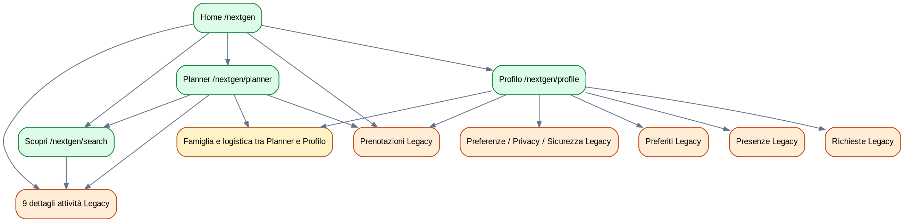

*La topologia mostra che la Next Gen non è ancora una piattaforma autonoma: le quattro aree principali delegano numerosi obiettivi alle route Legacy. Il grafo produce due navigazioni concorrenti e rende il browser back un meccanismo di recupero implicito.*

## 3.2 Inventario per generazione

| **Gruppo**                                                                                                            | **Pagine** | **Generazione**   |
| --------------------------------------------------------------------------------------------------------------------- | ---------- | ----------------- |
| Home, Planner, Calendario, Famiglia, Indirizzi, Promemoria, Profilo, Hub Famiglia, Impostazioni, Segnalazioni, Scopri | 11         | Next Gen          |
| 9 dettagli attività, Preferiti, Prenotazioni, Presenze, Preferenze, Privacy, Sicurezza, Richieste                     | 16         | Legacy richiamata |

## 3.3 Rischi architetturali

| **ID** | **Rischio**                         | **Severità** | **Impatto**                   | **Mitigazione**                      |
| ------ | ----------------------------------- | ------------ | ----------------------------- | ------------------------------------ |
| R-01   | Stato di journey perso tra route    | Alto         | Conversione e task completion | Context object + shell unica         |
| R-02   | Duplicazione di ownership           | Alto         | Evolutive divergenti          | Capability map + DDL                 |
| R-03   | Route Legacy nella nav primaria     | Alto         | Disorientamento               | Redirect e migrazione                |
| R-04   | Dati test nel catalogo              | Alto         | Fiducia e data quality        | Isolamento ambienti                  |
| R-05   | Privacy/share link non formalizzati | Alto         | Data exposure                 | Regole token, revoca, minimizzazione |
| R-06   | Assenza event taxonomy              | Medio-Alto   | Nessuna misura funnel         | Analytics by design                  |
| R-07   | Test per pagina, non per journey    | Medio-Alto   | Regressioni cross-route       | Playwright E2E                       |

**4. Principi e capability map**

| **ID** | **Principio**                  | **Applicazione**                                                                   |
| ------ | ------------------------------ | ---------------------------------------------------------------------------------- |
| P-01   | Journey first                  | La struttura segue obiettivi utente e non cartelle tecniche.                       |
| P-02   | Single ownership               | Ogni capability ha una sezione owner; le altre possono solo fare entry o supporto. |
| P-03   | State continuity               | Filtri, origine, settimana e bambino persistono finché il processo non termina.    |
| P-04   | One dominant CTA               | Una sola azione primaria derivata dallo stato della schermata.                     |
| P-05   | Progressive disclosure         | Dettaglio e opzioni avanzate compaiono solo quando necessarie.                     |
| P-06   | Object-first post-purchase     | Dopo l’acquisto l’oggetto primario è la prenotazione, non la scheda attività.      |
| P-07   | Privacy and security by design | Condivisione, membership e account lifecycle hanno stati e audit.                  |
| P-08   | Measure the journey            | Ogni step produce eventi correlabili e KPI azionabili.                             |
| P-09   | Migration-safe                 | Feature flag, redirect, rollback e telemetry sono parte della CR.                  |
| P-10   | Test the outcome               | I test automatici verificano il raggiungimento dell’obiettivo utente.              |

## 4.1 Capability ownership TO-BE

| **Capability**  | **Responsabilità**                                          | **Confine**                               |
| --------------- | ----------------------------------------------------------- | ----------------------------------------- |
| Home            | Orientamento, riepilogo, next best action                   | Non gestisce processi transazionali.      |
| Planner         | Copertura, calendario, piano, budget e gruppi se confermati | Owner del piano familiare.                |
| Scopri          | Ricerca, mappa, confronto, salvati, dettaglio attività      | Owner del pre-acquisto.                   |
| Le mie attività | Prenotazioni, dettaglio booking, presenze, richieste        | Owner del post-acquisto.                  |
| Famiglia        | Nucleo, bambini, membership, indirizzi, promemoria          | Capability trasversale con route proprie. |
| Profilo         | Identità, preferenze, sicurezza, privacy, feedback          | Owner della configurazione account.       |

**5. Audit completo delle 27 pagine**

*Una scheda strutturata per ogni route osservata*

Ogni scheda contiene evidenza osservata, ruolo percepito, problemi, disposizione target, KPI e Change Request. Le pagine Legacy di dettaglio condividono un template comune ma sono mantenute separate perché rappresentano route e punti di ingresso distinti.

**5.1 Home Next Gen**

<table>
<tbody>
<tr class="odd">
<td>Route 
/nextgen</td>
<td>Generazione 
Next Gen</td>
<td>Richiamata da 
Entry point / non indicato</td>
<td>Target 
Keep / migrate / merge secondo CR</td>
</tr>
</tbody>
</table>

### Ruolo e responsabilità osservata

Orientamento quotidiano e accesso ai principali obiettivi: continuare la pianificazione, esplorare attività e consultare lo stato familiare.

| **Evidenza**    | **Dettaglio**                                                                                                                                                                                                                              |
| --------------- | ------------------------------------------------------------------------------------------------------------------------------------------------------------------------------------------------------------------------------------------ |
| CTA / controlli | Continua a pianificare, Sì, In ritardo, No, 🤍, Segnala un problema, Torna a V1                                                                                                                                                             |
| Collegamenti    | /activity/laboratorio-arti-creative (Legacy), /activity/summer-camp-acquatico (Legacy), /activity/soccer-academy-estate (Legacy), /nextgen/planner (Next Gen), /nextgen (Next Gen), /nextgen/search (Next Gen), /prenotazioni (Legacy) ... |

### Punti di forza

  - > Introduzione chiara del paradigma organizzativo.

  - > Presenza di suggerimenti e next best action.

  - > Accesso diretto a Planner e Scopri.

### Problemi e rischi

  - > Le card attività aprono dettagli Legacy.

  - > Prenotazioni è una destinazione Legacy nella navigazione primaria.

  - > La Home combina riepilogo, raccomandazioni e micro-task con CTA concorrenti.

  - > I comandi “Torna a V1” e “Segnala un problema” rendono visibile lo stato transitorio del prodotto.

### Disposizione TO-BE

Mantenere come hub di orientamento; non deve ospitare transazioni. Tutte le card devono aprire route Next Gen preservando il contesto.

| **KPI pagina**                  | **Uso**                        |
| ------------------------------- | ------------------------------ |
| Time to first meaningful action | Misurare dopo instrumentazione |
| Home -\> Planner CTR            | Misurare dopo instrumentazione |
| Recommendation -\> Detail CTR   | Misurare dopo instrumentazione |
| Legacy exposure rate            | Misurare dopo instrumentazione |

**Change Request correlate: CR-001, CR-006, CR-007, CR-008, CR-009, CR-018, CR-043, CR-044, CR-048**

*Fonte: crawl applicativo mobile-chrome del 16/07/2026. Valutazione strutturale e di processo.*

**5.2 Planner - Organizzazione**

<table>
<tbody>
<tr class="odd">
<td>Route 
/nextgen/planner</td>
<td>Generazione 
Next Gen</td>
<td>Richiamata da 
https://buddykids-app.vercel.app/nextgen</td>
<td>Target 
Keep / migrate / merge secondo CR</td>
</tr>
</tbody>
</table>

### Ruolo e responsabilità osservata

Centro operativo per copertura delle settimane, viste, budget, gruppi e suggerimenti.

| **Evidenza**    | **Dettaglio**                                                                                                                                                                                                                                                  |
| --------------- | -------------------------------------------------------------------------------------------------------------------------------------------------------------------------------------------------------------------------------------------------------------- |
| CTA / controlli | Indietro, Organizzazione, Mappa, Budget, Gruppi, 1, 2, 3 ...                                                                                                                                                                                                   |
| Collegamenti    | /activity/attivita-test-buddykids (Legacy), /nextgen/search (Next Gen), /activity/laboratorio-arti-creative (Legacy), /activity/summer-camp-acquatico (Legacy), /activity/soccer-academy-estate (Legacy), /nextgen (Next Gen), /nextgen/planner (Next Gen) ... |

### Punti di forza

  - > Rende visibile la copertura per mese/settimana.

  - > CTA “Riempi” collega il bisogno alla ricerca.

  - > Consolida più strumenti organizzativi in un unico luogo.

### Problemi e rischi

  - > Responsabilità eccessivamente ampia: planning, mappa, budget, gruppi e raccomandazioni.

  - > Elementi pianificati e suggerimenti aprono dettagli Legacy.

  - > I selettori numerici e mensili non esplicitano chiaramente il modello di vista.

  - > La navigazione include Prenotazioni Legacy.

### Disposizione TO-BE

Planner unico con viste dichiarate, coverage slot e azione primaria dipendente dallo stato. Il click su attività pianificata apre il dettaglio prenotazione.

| **KPI pagina**                 | **Uso**                        |
| ------------------------------ | ------------------------------ |
| Coverage completion rate       | Misurare dopo instrumentazione |
| Planner weekly active families | Misurare dopo instrumentazione |
| Riempi -\> booking conversion  | Misurare dopo instrumentazione |
| View switching/backtrack rate  | Misurare dopo instrumentazione |

**Change Request correlate: CR-005, CR-006, CR-015, CR-016, CR-021, CR-022, CR-023, CR-026, CR-035**

*Fonte: crawl applicativo mobile-chrome del 16/07/2026. Valutazione strutturale e di processo.*

**5.3 Planner - Calendario**

<table>
<tbody>
<tr class="odd">
<td>Route 
/nextgen/planner?mode=calendario</td>
<td>Generazione 
Next Gen</td>
<td>Richiamata da 
https://buddykids-app.vercel.app/nextgen/profile/famiglia</td>
<td>Target 
Keep / migrate / merge secondo CR</td>
</tr>
</tbody>
</table>

### Ruolo e responsabilità osservata

Rappresentazione temporale mensile/settimanale del medesimo piano familiare e punto di condivisione.

| **Evidenza**    | **Dettaglio**                                                                                                                                                                                                                                                  |
| --------------- | -------------------------------------------------------------------------------------------------------------------------------------------------------------------------------------------------------------------------------------------------------------- |
| CTA / controlli | Indietro, Organizzazione, Mappa, Budget, Gruppi, 1, 2, 3 ...                                                                                                                                                                                                   |
| Collegamenti    | /activity/attivita-test-buddykids (Legacy), /nextgen/search (Next Gen), /activity/laboratorio-arti-creative (Legacy), /activity/summer-camp-acquatico (Legacy), /activity/soccer-academy-estate (Legacy), /nextgen (Next Gen), /nextgen/planner (Next Gen) ... |

### Punti di forza

  - > Supporta viste mese/settimana.

  - > Include condivisione e revoca del piano.

  - > Mantiene coerenza di contenuto con il Planner.

### Problemi e rischi

  - > È raggiunto dal Profilo/Famiglia, pur essendo una modalità del Planner.

  - > Duplica controlli e contenuti dell’organizzazione.

  - > Condivisione e pianificazione risultano mescolate senza una gerarchia esplicita.

  - > Dettagli attività restano Legacy.

### Disposizione TO-BE

Modalità interna del Planner con stato condiviso; la condivisione è un’azione del periodo selezionato, non una responsabilità del Profilo.

| **KPI pagina**                   | **Uso**                        |
| -------------------------------- | ------------------------------ |
| Calendar mode adoption           | Misurare dopo instrumentazione |
| Share conversion                 | Misurare dopo instrumentazione |
| State preservation between views | Misurare dopo instrumentazione |
| Legacy detail opens              | Misurare dopo instrumentazione |

**Change Request correlate: CR-005, CR-022, CR-023, CR-032, CR-033**

*Fonte: crawl applicativo mobile-chrome del 16/07/2026. Valutazione strutturale e di processo.*

**5.4 Famiglia - Crea o entra**

<table>
<tbody>
<tr class="odd">
<td>Route 
/nextgen/planner/famiglia</td>
<td>Generazione 
Next Gen</td>
<td>Richiamata da 
https://buddykids-app.vercel.app/nextgen/profile/famiglia</td>
<td>Target 
Keep / migrate / merge secondo CR</td>
</tr>
</tbody>
</table>

### Ruolo e responsabilità osservata

Creazione del nucleo familiare o ingresso tramite invito.

| **Evidenza**    | **Dettaglio**                                                                                                                     |
| --------------- | --------------------------------------------------------------------------------------------------------------------------------- |
| CTA / controlli | Indietro, Crea famiglia, Entra nella famiglia, Segnala un problema, Torna a V1                                                    |
| Collegamenti    | /nextgen (Next Gen), /nextgen/planner (Next Gen), /nextgen/search (Next Gen), /prenotazioni (Legacy), /nextgen/profile (Next Gen) |

### Punti di forza

  - > Presenta due scelte principali comprensibili.

  - > Riduce la complessità iniziale del setup.

### Problemi e rischi

  - > La route sotto Planner contraddice il dominio Famiglia.

  - > L’ingresso arriva dal Profilo/Famiglia, generando rimbalzo tra aree.

  - > Non sono osservabili ruoli, stato invito, scadenza o gestione errori.

### Disposizione TO-BE

Spostare nel dominio Famiglia con lifecycle esplicito di household e membership.

| **KPI pagina**                | **Uso**                        |
| ----------------------------- | ------------------------------ |
| Household creation completion | Misurare dopo instrumentazione |
| Join completion               | Misurare dopo instrumentazione |
| Invite error rate             | Misurare dopo instrumentazione |
| Time to active household      | Misurare dopo instrumentazione |

**Change Request correlate: CR-003, CR-027, CR-028, CR-043**

*Fonte: crawl applicativo mobile-chrome del 16/07/2026. Valutazione strutturale e di processo.*

**5.5 Famiglia - Indirizzi**

<table>
<tbody>
<tr class="odd">
<td>Route 
/nextgen/planner/indirizzi</td>
<td>Generazione 
Next Gen</td>
<td>Richiamata da 
https://buddykids-app.vercel.app/nextgen/profile/famiglia</td>
<td>Target 
Keep / migrate / merge secondo CR</td>
</tr>
</tbody>
</table>

### Ruolo e responsabilità osservata

Gestione di casa, lavoro e punti di partenza per logistica e travel time.

| **Evidenza**    | **Dettaglio**                                                                                                                     |
| --------------- | --------------------------------------------------------------------------------------------------------------------------------- |
| CTA / controlli | Indietro, Modifica, Rimuovi, Salva, Segnala un problema, Torna a V1                                                               |
| Collegamenti    | /nextgen (Next Gen), /nextgen/planner (Next Gen), /nextgen/search (Next Gen), /prenotazioni (Legacy), /nextgen/profile (Next Gen) |

### Punti di forza

  - > Azioni Modifica, Rimuovi e Salva esplicite.

  - > Abilita funzioni ad alto valore come promemoria di partenza.

### Problemi e rischi

  - > Collocazione tecnica sotto Planner ma semantica sotto Famiglia/Logistica.

  - > Non è evidente il concetto di indirizzo predefinito per contesto.

  - > Rimozione e salvataggio necessitano regole di validazione e conferma.

### Disposizione TO-BE

Famiglia \> Logistica \> Indirizzi, con tipi, default e validazione geografica.

| **KPI pagina**           | **Uso**                        |
| ------------------------ | ------------------------------ |
| Address save success     | Misurare dopo instrumentazione |
| Validation error rate    | Misurare dopo instrumentazione |
| Default address coverage | Misurare dopo instrumentazione |
| Delete cancellation rate | Misurare dopo instrumentazione |

**Change Request correlate: CR-003, CR-029, CR-030, CR-043**

*Fonte: crawl applicativo mobile-chrome del 16/07/2026. Valutazione strutturale e di processo.*

**5.6 Famiglia - Promemoria logistici**

<table>
<tbody>
<tr class="odd">
<td>Route 
/nextgen/planner/promemoria</td>
<td>Generazione 
Next Gen</td>
<td>Richiamata da 
https://buddykids-app.vercel.app/nextgen/profile/famiglia</td>
<td>Target 
Keep / migrate / merge secondo CR</td>
</tr>
</tbody>
</table>

### Ruolo e responsabilità osservata

Attivazione di avvisi di partenza collegati a luogo e attività.

| **Evidenza**    | **Dettaglio**                                                                                                                     |
| --------------- | --------------------------------------------------------------------------------------------------------------------------------- |
| CTA / controlli | Indietro, Promemoria attivo, Partenza consigliata, Casa, Segnala un problema, Torna a V1                                          |
| Collegamenti    | /nextgen (Next Gen), /nextgen/planner (Next Gen), /nextgen/search (Next Gen), /prenotazioni (Legacy), /nextgen/profile (Next Gen) |

### Punti di forza

  - > Valore utente immediato e coerente con la promessa di TRAMA.

  - > Distingue attivazione e partenza consigliata.

### Problemi e rischi

  - > La funzione è presentata come anteprima e non come processo completo.

  - > Manca un contratto esplicito per origine, anticipo, canale e fallback.

  - > Collocazione sotto Planner non coerente con la configurazione familiare.

### Disposizione TO-BE

Regole di promemoria nel dominio Famiglia/Logistica, consumate dal Planner e dalle Prenotazioni.

| **KPI pagina**                | **Uso**                        |
| ----------------------------- | ------------------------------ |
| Reminder activation rate      | Misurare dopo instrumentazione |
| Notification delivery success | Misurare dopo instrumentazione |
| Open-to-event rate            | Misurare dopo instrumentazione |
| Opt-out rate                  | Misurare dopo instrumentazione |

**Change Request correlate: CR-030, CR-031, CR-039, CR-044**

*Fonte: crawl applicativo mobile-chrome del 16/07/2026. Valutazione strutturale e di processo.*

**5.7 Profilo**

<table>
<tbody>
<tr class="odd">
<td>Route 
/nextgen/profile</td>
<td>Generazione 
Next Gen</td>
<td>Richiamata da 
https://buddykids-app.vercel.app/nextgen</td>
<td>Target 
Keep / migrate / merge secondo CR</td>
</tr>
</tbody>
</table>

### Ruolo e responsabilità osservata

Identità utente, accesso alle configurazioni e, oggi, hub di processi operativi.

| **Evidenza**    | **Dettaglio**                                                                                                                                                                                                      |
| --------------- | ------------------------------------------------------------------------------------------------------------------------------------------------------------------------------------------------------------------ |
| CTA / controlli | Indietro, Cambia foto, Modifica, Esci dall'account, Segnala un problema, Torna a V1                                                                                                                                |
| Collegamenti    | /prenotazioni (Legacy), /preferiti (Legacy), /presenze (Legacy), /nextgen/profile/famiglia (Next Gen), /richieste (Legacy), /nextgen/profile/impostazioni (Next Gen), /nextgen/profile/segnalazioni (Next Gen) ... |

### Punti di forza

  - > Raccoglie punti di ingresso rilevanti.

  - > Distingue aree con descrizioni sintetiche.

### Problemi e rischi

  - > Mescola identità, prenotazioni, preferiti, presenze, richieste, famiglia, impostazioni e segnalazioni.

  - > Quattro voci operative aprono pagine Legacy.

  - > La responsabilità della sezione non è prevedibile.

### Disposizione TO-BE

Profilo limitato a identità, account, impostazioni e feedback. Prenotazioni/presenze/richieste confluiscono in “Le mie attività”; preferiti in Scopri.

| **KPI pagina**                      | **Uso**                        |
| ----------------------------------- | ------------------------------ |
| Task success by profile destination | Misurare dopo instrumentazione |
| Misnavigation rate                  | Misurare dopo instrumentazione |
| Profile bounce rate                 | Misurare dopo instrumentazione |
| Legacy exits                        | Misurare dopo instrumentazione |

**Change Request correlate: CR-002, CR-003, CR-004, CR-038, CR-039, CR-042**

*Fonte: crawl applicativo mobile-chrome del 16/07/2026. Valutazione strutturale e di processo.*

**5.8 Hub Famiglia e logistica**

<table>
<tbody>
<tr class="odd">
<td>Route 
/nextgen/profile/famiglia</td>
<td>Generazione 
Next Gen</td>
<td>Richiamata da 
https://buddykids-app.vercel.app/nextgen/profile</td>
<td>Target 
Keep / migrate / merge secondo CR</td>
</tr>
</tbody>
</table>

### Ruolo e responsabilità osservata

Indice di indirizzi, nucleo, condivisione piano e promemoria.

| **Evidenza**    | **Dettaglio**                                                                                                                                                                                                                                      |
| --------------- | -------------------------------------------------------------------------------------------------------------------------------------------------------------------------------------------------------------------------------------------------- |
| CTA / controlli | Indietro, Segnala un problema, Torna a V1                                                                                                                                                                                                          |
| Collegamenti    | /nextgen/planner/indirizzi (Next Gen), /nextgen/planner/famiglia (Next Gen), /nextgen/planner?mode=calendario (Next Gen), /nextgen/planner/promemoria (Next Gen), /nextgen (Next Gen), /nextgen/planner (Next Gen), /nextgen/search (Next Gen) ... |

### Punti di forza

  - > Raggruppa capability logicamente correlate.

  - > Descrizioni delle card orientate al beneficio.

### Problemi e rischi

  - > Tutte le destinazioni cambiano dominio di route verso Planner.

  - > Condivisione piano è un’azione del Planner, mentre indirizzi e membership sono dati Famiglia.

  - > La pagina compensa una IA non stabilizzata.

### Disposizione TO-BE

Famiglia come capability autonoma: nucleo, bambini, adulti, indirizzi e promemoria; link contestuale alla condivisione del Planner.

| **KPI pagina**              | **Uso**                        |
| --------------------------- | ------------------------------ |
| Family hub task success     | Misurare dopo instrumentazione |
| Cross-area navigation count | Misurare dopo instrumentazione |
| Household completion        | Misurare dopo instrumentazione |
| Logistics completion        | Misurare dopo instrumentazione |

**Change Request correlate: CR-003, CR-027, CR-028, CR-029, CR-031, CR-032**

*Fonte: crawl applicativo mobile-chrome del 16/07/2026. Valutazione strutturale e di processo.*

**5.9 Hub Impostazioni**

<table>
<tbody>
<tr class="odd">
<td>Route 
/nextgen/profile/impostazioni</td>
<td>Generazione 
Next Gen</td>
<td>Richiamata da 
https://buddykids-app.vercel.app/nextgen/profile</td>
<td>Target 
Keep / migrate / merge secondo CR</td>
</tr>
</tbody>
</table>

### Ruolo e responsabilità osservata

Indice per sicurezza, preferenze, privacy e account.

| **Evidenza**    | **Dettaglio**                                                                                                                                                                                  |
| --------------- | ---------------------------------------------------------------------------------------------------------------------------------------------------------------------------------------------- |
| CTA / controlli | Indietro, Segnala un problema, Torna a V1                                                                                                                                                      |
| Collegamenti    | /profile/sicurezza (Legacy), /profile/preferenze (Legacy), /profile/privacy (Legacy), /nextgen (Next Gen), /nextgen/planner (Next Gen), /nextgen/search (Next Gen), /prenotazioni (Legacy) ... |

### Punti di forza

  - > Tassonomia di primo livello corretta.

  - > Descrizioni comprensibili.

### Problemi e rischi

  - > Tutte le destinazioni core sono ancora Legacy.

  - > Cambio shell su azioni ad alta sensibilità.

  - > Non è chiara la separazione tra privacy, consensi e lifecycle account.

### Disposizione TO-BE

Migrazione completa Next Gen con governance di sicurezza e privacy e tracciamento degli stati.

| **KPI pagina**             | **Uso**                        |
| -------------------------- | ------------------------------ |
| Settings completion        | Misurare dopo instrumentazione |
| Legacy settings exposure   | Misurare dopo instrumentazione |
| Security task error rate   | Misurare dopo instrumentazione |
| Privacy action abandonment | Misurare dopo instrumentazione |

**Change Request correlate: CR-039, CR-040, CR-041, CR-046, CR-047**

*Fonte: crawl applicativo mobile-chrome del 16/07/2026. Valutazione strutturale e di processo.*

**5.10 Le mie segnalazioni**

<table>
<tbody>
<tr class="odd">
<td>Route 
/nextgen/profile/segnalazioni</td>
<td>Generazione 
Next Gen</td>
<td>Richiamata da 
https://buddykids-app.vercel.app/nextgen/profile</td>
<td>Target 
Keep / migrate / merge secondo CR</td>
</tr>
</tbody>
</table>

### Ruolo e responsabilità osservata

Consultazione dello stato di bug e suggerimenti inviati durante la beta.

| **Evidenza**    | **Dettaglio**                                                                                                                     |
| --------------- | --------------------------------------------------------------------------------------------------------------------------------- |
| CTA / controlli | Indietro, Segnala un problema, Torna a V1                                                                                         |
| Collegamenti    | /nextgen (Next Gen), /nextgen/planner (Next Gen), /nextgen/search (Next Gen), /prenotazioni (Legacy), /nextgen/profile (Next Gen) |

### Punti di forza

  - > Introduce trasparenza sul feedback.

  - > Separazione dalla richiesta al centro.

### Problemi e rischi

  - > La route è nel Profilo ma il processo è di supporto/prodotto.

  - > Le azioni osservate non evidenziano filtri, dettaglio o stato del ticket.

  - > La semantica “beta” non è sostenibile nel prodotto stabile.

### Disposizione TO-BE

Area Feedback con categorie, severità, stato, dettaglio e comunicazioni; accessibile dal Profilo ma governata come processo di supporto.

| **KPI pagina**           | **Uso**                        |
| ------------------------ | ------------------------------ |
| Issue submission success | Misurare dopo instrumentazione |
| Status visibility        | Misurare dopo instrumentazione |
| Resolution SLA           | Misurare dopo instrumentazione |
| Duplicate issue rate     | Misurare dopo instrumentazione |

**Change Request correlate: CR-042, CR-044, CR-047**

*Fonte: crawl applicativo mobile-chrome del 16/07/2026. Valutazione strutturale e di processo.*

**5.11 Scopri / Ricerca**

<table>
<tbody>
<tr class="odd">
<td>Route 
/nextgen/search</td>
<td>Generazione 
Next Gen</td>
<td>Richiamata da 
https://buddykids-app.vercel.app/nextgen</td>
<td>Target 
Keep / migrate / merge secondo CR</td>
</tr>
</tbody>
</table>

### Ruolo e responsabilità osservata

Ricerca e discovery di attività in lista o mappa.

| **Evidenza**    | **Dettaglio**                                                                                                                                                                                                                                                                                                   |
| --------------- | --------------------------------------------------------------------------------------------------------------------------------------------------------------------------------------------------------------------------------------------------------------------------------------------------------------- |
| CTA / controlli | Indietro, Lista, Mappa, 🤍, Segnala un problema, Torna a V1                                                                                                                                                                                                                                                      |
| Collegamenti    | /activity/attivita-test-buddykids (Legacy), /activity/laboratorio-arti-creative (Legacy), /activity/soccer-academy-estate (Legacy), /activity/summer-music-camp (Legacy), /activity/test (Legacy), /activity/test-attivita-auto-1784107753260 (Legacy), /activity/test-attivita-auto-1784108193968 (Legacy) ... |

### Punti di forza

  - > Lista e mappa come modalità complementari.

  - > Card ricche di match, distanza, età, categorie, prezzo e disponibilità.

### Problemi e rischi

  - > Tutti gli otto risultati osservati aprono dettagli Legacy.

  - > Non risultano CTA di filtro esplicite nell’inventario dei pulsanti.

  - > Il contesto del Planner non è visibile né persistito.

  - > Sono presenti attività test tra i risultati.

### Disposizione TO-BE

Scopri Next Gen con filtri condivisi lista/mappa, contesto opzionale del Planner e dettaglio Next Gen.

| **KPI pagina**        | **Uso**                        |
| --------------------- | ------------------------------ |
| Search success rate   | Misurare dopo instrumentazione |
| Result -\> detail CTR | Misurare dopo instrumentazione |
| Filter usage          | Misurare dopo instrumentazione |
| No-result rate        | Misurare dopo instrumentazione |
| Test data leakage     | Misurare dopo instrumentazione |

**Change Request correlate: CR-006, CR-009, CR-016, CR-017, CR-018, CR-019, CR-047**

*Fonte: crawl applicativo mobile-chrome del 16/07/2026. Valutazione strutturale e di processo.*

**5.12 Dettaglio attività - BuddyKids test**

<table>
<tbody>
<tr class="odd">
<td>Route 
/activity/attivita-test-buddykids</td>
<td>Generazione 
Legacy richiamata</td>
<td>Richiamata da 
https://buddykids-app.vercel.app/nextgen/planner</td>
<td>Target 
Keep / migrate / merge secondo CR</td>
</tr>
</tbody>
</table>

### Ruolo e responsabilità osservata

Dettaglio generico raggiunto sia da attività pianificata sia da ricerca; oggi sostituisce impropriamente il dettaglio prenotazione.

| **Evidenza**    | **Dettaglio**                             |
| --------------- | ----------------------------------------- |
| CTA / controlli | Contatta il gestore, Passa a NextGen      |
| Collegamenti    | /booking/attivita-test-buddykids (Legacy) |

### Punti di forza

  - > CTA “Prenota ora” e “Contatta il gestore” chiare.

  - > La pagina costituisce il punto informativo prima della conversione.

### Problemi e rischi

  - > Cambio completo di shell e navigazione rispetto a Next Gen.

  - > Booking successivo è anch’esso Legacy e non preserva il contesto di origine.

  - > Il comando “Passa a NextGen” rende esplicita la frammentazione.

  - > Manca un contratto Next Gen uniforme per contenuti, disponibilità, idoneità e CTA.

  - > Dal Planner, il click su un elemento già prenotato dovrebbe aprire il booking, non il catalogo.

### Disposizione TO-BE

Migrare al template Dettaglio attività Next Gen, con disponibilità, selezione bambino, salvataggio e contatto contestuale.

| **KPI pagina**                | **Uso**                        |
| ----------------------------- | ------------------------------ |
| Detail -\> booking conversion | Misurare dopo instrumentazione |
| Contact rate                  | Misurare dopo instrumentazione |
| Back-to-results success       | Misurare dopo instrumentazione |
| Legacy exposure rate          | Misurare dopo instrumentazione |

**Change Request correlate: CR-009, CR-010, CR-011, CR-012, CR-013, CR-020, CR-008, CR-035**

*Fonte: crawl applicativo mobile-chrome del 16/07/2026. Valutazione strutturale e di processo.*

**5.13 Dettaglio attività - Coding & Robotica Kids**

<table>
<tbody>
<tr class="odd">
<td>Route 
/activity/coding-robotica-kids</td>
<td>Generazione 
Legacy richiamata</td>
<td>Richiamata da 
https://buddykids-app.vercel.app/nextgen/search</td>
<td>Target 
Keep / migrate / merge secondo CR</td>
</tr>
</tbody>
</table>

### Ruolo e responsabilità osservata

Dettaglio informativo dell’attività raggiunto da Home, Planner o Scopri.

| **Evidenza**    | **Dettaglio**                          |
| --------------- | -------------------------------------- |
| CTA / controlli | Contatta il gestore, Passa a NextGen   |
| Collegamenti    | /booking/coding-robotica-kids (Legacy) |

### Punti di forza

  - > CTA “Prenota ora” e “Contatta il gestore” chiare.

  - > La pagina costituisce il punto informativo prima della conversione.

### Problemi e rischi

  - > Cambio completo di shell e navigazione rispetto a Next Gen.

  - > Booking successivo è anch’esso Legacy e non preserva il contesto di origine.

  - > Il comando “Passa a NextGen” rende esplicita la frammentazione.

  - > Manca un contratto Next Gen uniforme per contenuti, disponibilità, idoneità e CTA.

### Disposizione TO-BE

Migrare al template Dettaglio attività Next Gen, con disponibilità, selezione bambino, salvataggio e contatto contestuale.

| **KPI pagina**                | **Uso**                        |
| ----------------------------- | ------------------------------ |
| Detail -\> booking conversion | Misurare dopo instrumentazione |
| Contact rate                  | Misurare dopo instrumentazione |
| Back-to-results success       | Misurare dopo instrumentazione |
| Legacy exposure rate          | Misurare dopo instrumentazione |

**Change Request correlate: CR-009, CR-010, CR-011, CR-012, CR-013, CR-020, CR-008**

*Fonte: crawl applicativo mobile-chrome del 16/07/2026. Valutazione strutturale e di processo.*

**5.14 Dettaglio attività - Laboratorio Arti Creative**

<table>
<tbody>
<tr class="odd">
<td>Route 
/activity/laboratorio-arti-creative</td>
<td>Generazione 
Legacy richiamata</td>
<td>Richiamata da 
https://buddykids-app.vercel.app/nextgen</td>
<td>Target 
Keep / migrate / merge secondo CR</td>
</tr>
</tbody>
</table>

### Ruolo e responsabilità osservata

Dettaglio informativo dell’attività raggiunto da Home, Planner o Scopri.

| **Evidenza**    | **Dettaglio**                               |
| --------------- | ------------------------------------------- |
| CTA / controlli | Contatta il gestore, Passa a NextGen        |
| Collegamenti    | /booking/laboratorio-arti-creative (Legacy) |

### Punti di forza

  - > CTA “Prenota ora” e “Contatta il gestore” chiare.

  - > La pagina costituisce il punto informativo prima della conversione.

### Problemi e rischi

  - > Cambio completo di shell e navigazione rispetto a Next Gen.

  - > Booking successivo è anch’esso Legacy e non preserva il contesto di origine.

  - > Il comando “Passa a NextGen” rende esplicita la frammentazione.

  - > Manca un contratto Next Gen uniforme per contenuti, disponibilità, idoneità e CTA.

### Disposizione TO-BE

Migrare al template Dettaglio attività Next Gen, con disponibilità, selezione bambino, salvataggio e contatto contestuale.

| **KPI pagina**                | **Uso**                        |
| ----------------------------- | ------------------------------ |
| Detail -\> booking conversion | Misurare dopo instrumentazione |
| Contact rate                  | Misurare dopo instrumentazione |
| Back-to-results success       | Misurare dopo instrumentazione |
| Legacy exposure rate          | Misurare dopo instrumentazione |

**Change Request correlate: CR-009, CR-010, CR-011, CR-012, CR-013, CR-020, CR-008**

*Fonte: crawl applicativo mobile-chrome del 16/07/2026. Valutazione strutturale e di processo.*

**5.15 Dettaglio attività - Soccer Academy Estate**

<table>
<tbody>
<tr class="odd">
<td>Route 
/activity/soccer-academy-estate</td>
<td>Generazione 
Legacy richiamata</td>
<td>Richiamata da 
https://buddykids-app.vercel.app/nextgen</td>
<td>Target 
Keep / migrate / merge secondo CR</td>
</tr>
</tbody>
</table>

### Ruolo e responsabilità osservata

Dettaglio informativo dell’attività raggiunto da Home, Planner o Scopri.

| **Evidenza**    | **Dettaglio**                           |
| --------------- | --------------------------------------- |
| CTA / controlli | Contatta il gestore, Passa a NextGen    |
| Collegamenti    | /booking/soccer-academy-estate (Legacy) |

### Punti di forza

  - > CTA “Prenota ora” e “Contatta il gestore” chiare.

  - > La pagina costituisce il punto informativo prima della conversione.

### Problemi e rischi

  - > Cambio completo di shell e navigazione rispetto a Next Gen.

  - > Booking successivo è anch’esso Legacy e non preserva il contesto di origine.

  - > Il comando “Passa a NextGen” rende esplicita la frammentazione.

  - > Manca un contratto Next Gen uniforme per contenuti, disponibilità, idoneità e CTA.

### Disposizione TO-BE

Migrare al template Dettaglio attività Next Gen, con disponibilità, selezione bambino, salvataggio e contatto contestuale.

| **KPI pagina**                | **Uso**                        |
| ----------------------------- | ------------------------------ |
| Detail -\> booking conversion | Misurare dopo instrumentazione |
| Contact rate                  | Misurare dopo instrumentazione |
| Back-to-results success       | Misurare dopo instrumentazione |
| Legacy exposure rate          | Misurare dopo instrumentazione |

**Change Request correlate: CR-009, CR-010, CR-011, CR-012, CR-013, CR-020, CR-008**

*Fonte: crawl applicativo mobile-chrome del 16/07/2026. Valutazione strutturale e di processo.*

**5.16 Dettaglio attività - Summer Camp Acquatico**

<table>
<tbody>
<tr class="odd">
<td>Route 
/activity/summer-camp-acquatico</td>
<td>Generazione 
Legacy richiamata</td>
<td>Richiamata da 
https://buddykids-app.vercel.app/nextgen</td>
<td>Target 
Keep / migrate / merge secondo CR</td>
</tr>
</tbody>
</table>

### Ruolo e responsabilità osservata

Dettaglio informativo dell’attività raggiunto da Home, Planner o Scopri.

| **Evidenza**    | **Dettaglio**                           |
| --------------- | --------------------------------------- |
| CTA / controlli | Contatta il gestore, Passa a NextGen    |
| Collegamenti    | /booking/summer-camp-acquatico (Legacy) |

### Punti di forza

  - > CTA “Prenota ora” e “Contatta il gestore” chiare.

  - > La pagina costituisce il punto informativo prima della conversione.

### Problemi e rischi

  - > Cambio completo di shell e navigazione rispetto a Next Gen.

  - > Booking successivo è anch’esso Legacy e non preserva il contesto di origine.

  - > Il comando “Passa a NextGen” rende esplicita la frammentazione.

  - > Manca un contratto Next Gen uniforme per contenuti, disponibilità, idoneità e CTA.

### Disposizione TO-BE

Migrare al template Dettaglio attività Next Gen, con disponibilità, selezione bambino, salvataggio e contatto contestuale.

| **KPI pagina**                | **Uso**                        |
| ----------------------------- | ------------------------------ |
| Detail -\> booking conversion | Misurare dopo instrumentazione |
| Contact rate                  | Misurare dopo instrumentazione |
| Back-to-results success       | Misurare dopo instrumentazione |
| Legacy exposure rate          | Misurare dopo instrumentazione |

**Change Request correlate: CR-009, CR-010, CR-011, CR-012, CR-013, CR-020, CR-008**

*Fonte: crawl applicativo mobile-chrome del 16/07/2026. Valutazione strutturale e di processo.*

**5.17 Dettaglio attività - Summer Music Camp**

<table>
<tbody>
<tr class="odd">
<td>Route 
/activity/summer-music-camp</td>
<td>Generazione 
Legacy richiamata</td>
<td>Richiamata da 
https://buddykids-app.vercel.app/nextgen/search</td>
<td>Target 
Keep / migrate / merge secondo CR</td>
</tr>
</tbody>
</table>

### Ruolo e responsabilità osservata

Dettaglio informativo dell’attività raggiunto da Home, Planner o Scopri.

| **Evidenza**    | **Dettaglio**                        |
| --------------- | ------------------------------------ |
| CTA / controlli | Contatta il gestore, Passa a NextGen |
| Collegamenti    | /booking/summer-music-camp (Legacy)  |

### Punti di forza

  - > CTA “Prenota ora” e “Contatta il gestore” chiare.

  - > La pagina costituisce il punto informativo prima della conversione.

### Problemi e rischi

  - > Cambio completo di shell e navigazione rispetto a Next Gen.

  - > Booking successivo è anch’esso Legacy e non preserva il contesto di origine.

  - > Il comando “Passa a NextGen” rende esplicita la frammentazione.

  - > Manca un contratto Next Gen uniforme per contenuti, disponibilità, idoneità e CTA.

### Disposizione TO-BE

Migrare al template Dettaglio attività Next Gen, con disponibilità, selezione bambino, salvataggio e contatto contestuale.

| **KPI pagina**                | **Uso**                        |
| ----------------------------- | ------------------------------ |
| Detail -\> booking conversion | Misurare dopo instrumentazione |
| Contact rate                  | Misurare dopo instrumentazione |
| Back-to-results success       | Misurare dopo instrumentazione |
| Legacy exposure rate          | Misurare dopo instrumentazione |

**Change Request correlate: CR-009, CR-010, CR-011, CR-012, CR-013, CR-020, CR-008**

*Fonte: crawl applicativo mobile-chrome del 16/07/2026. Valutazione strutturale e di processo.*

**5.18 Dettaglio attività - Test centro estivo**

<table>
<tbody>
<tr class="odd">
<td>Route 
/activity/test</td>
<td>Generazione 
Legacy richiamata</td>
<td>Richiamata da 
https://buddykids-app.vercel.app/nextgen/search</td>
<td>Target 
Keep / migrate / merge secondo CR</td>
</tr>
</tbody>
</table>

### Ruolo e responsabilità osservata

Dettaglio di attività test esposta nel catalogo applicativo.

| **Evidenza**    | **Dettaglio**                                                                                                                        |
| --------------- | ------------------------------------------------------------------------------------------------------------------------------------ |
| CTA / controlli | Apri la copertina a schermo intero, Contatta il gestore, Apri foto 1 a schermo intero, Apri foto 2 a schermo intero, Passa a NextGen |
| Collegamenti    | /booking/test (Legacy)                                                                                                               |

### Punti di forza

  - > CTA “Prenota ora” e “Contatta il gestore” chiare.

  - > La pagina costituisce il punto informativo prima della conversione.

### Problemi e rischi

  - > Cambio completo di shell e navigazione rispetto a Next Gen.

  - > Booking successivo è anch’esso Legacy e non preserva il contesto di origine.

  - > Il comando “Passa a NextGen” rende esplicita la frammentazione.

  - > Manca un contratto Next Gen uniforme per contenuti, disponibilità, idoneità e CTA.

  - > Dati test visibili nella journey utente: rischio reputazionale, analytics contaminati e conversioni non valide.

### Disposizione TO-BE

Migrare al template Dettaglio attività Next Gen, con disponibilità, selezione bambino, salvataggio e contatto contestuale.

| **KPI pagina**                | **Uso**                        |
| ----------------------------- | ------------------------------ |
| Detail -\> booking conversion | Misurare dopo instrumentazione |
| Contact rate                  | Misurare dopo instrumentazione |
| Back-to-results success       | Misurare dopo instrumentazione |
| Legacy exposure rate          | Misurare dopo instrumentazione |

**Change Request correlate: CR-009, CR-010, CR-011, CR-012, CR-013, CR-020, CR-008, CR-047, CR-048**

*Fonte: crawl applicativo mobile-chrome del 16/07/2026. Valutazione strutturale e di processo.*

**5.19 Dettaglio attività - Auto test 1784107753260**

<table>
<tbody>
<tr class="odd">
<td>Route 
/activity/test-attivita-auto-1784107753260</td>
<td>Generazione 
Legacy richiamata</td>
<td>Richiamata da 
https://buddykids-app.vercel.app/nextgen/search</td>
<td>Target 
Keep / migrate / merge secondo CR</td>
</tr>
</tbody>
</table>

### Ruolo e responsabilità osservata

Dettaglio di attività test esposta nel catalogo applicativo.

| **Evidenza**    | **Dettaglio**                                      |
| --------------- | -------------------------------------------------- |
| CTA / controlli | Contatta il gestore, Passa a NextGen               |
| Collegamenti    | /booking/test-attivita-auto-1784107753260 (Legacy) |

### Punti di forza

  - > CTA “Prenota ora” e “Contatta il gestore” chiare.

  - > La pagina costituisce il punto informativo prima della conversione.

### Problemi e rischi

  - > Cambio completo di shell e navigazione rispetto a Next Gen.

  - > Booking successivo è anch’esso Legacy e non preserva il contesto di origine.

  - > Il comando “Passa a NextGen” rende esplicita la frammentazione.

  - > Manca un contratto Next Gen uniforme per contenuti, disponibilità, idoneità e CTA.

  - > Dati test visibili nella journey utente: rischio reputazionale, analytics contaminati e conversioni non valide.

### Disposizione TO-BE

Migrare al template Dettaglio attività Next Gen, con disponibilità, selezione bambino, salvataggio e contatto contestuale.

| **KPI pagina**                | **Uso**                        |
| ----------------------------- | ------------------------------ |
| Detail -\> booking conversion | Misurare dopo instrumentazione |
| Contact rate                  | Misurare dopo instrumentazione |
| Back-to-results success       | Misurare dopo instrumentazione |
| Legacy exposure rate          | Misurare dopo instrumentazione |

**Change Request correlate: CR-009, CR-010, CR-011, CR-012, CR-013, CR-020, CR-008, CR-047, CR-048**

*Fonte: crawl applicativo mobile-chrome del 16/07/2026. Valutazione strutturale e di processo.*

**5.20 Dettaglio attività - Auto test 1784108193968**

<table>
<tbody>
<tr class="odd">
<td>Route 
/activity/test-attivita-auto-1784108193968</td>
<td>Generazione 
Legacy richiamata</td>
<td>Richiamata da 
https://buddykids-app.vercel.app/nextgen/search</td>
<td>Target 
Keep / migrate / merge secondo CR</td>
</tr>
</tbody>
</table>

### Ruolo e responsabilità osservata

Dettaglio di attività test esposta nel catalogo applicativo.

| **Evidenza**    | **Dettaglio**                                      |
| --------------- | -------------------------------------------------- |
| CTA / controlli | Contatta il gestore, Passa a NextGen               |
| Collegamenti    | /booking/test-attivita-auto-1784108193968 (Legacy) |

### Punti di forza

  - > CTA “Prenota ora” e “Contatta il gestore” chiare.

  - > La pagina costituisce il punto informativo prima della conversione.

### Problemi e rischi

  - > Cambio completo di shell e navigazione rispetto a Next Gen.

  - > Booking successivo è anch’esso Legacy e non preserva il contesto di origine.

  - > Il comando “Passa a NextGen” rende esplicita la frammentazione.

  - > Manca un contratto Next Gen uniforme per contenuti, disponibilità, idoneità e CTA.

  - > Dati test visibili nella journey utente: rischio reputazionale, analytics contaminati e conversioni non valide.

### Disposizione TO-BE

Migrare al template Dettaglio attività Next Gen, con disponibilità, selezione bambino, salvataggio e contatto contestuale.

| **KPI pagina**                | **Uso**                        |
| ----------------------------- | ------------------------------ |
| Detail -\> booking conversion | Misurare dopo instrumentazione |
| Contact rate                  | Misurare dopo instrumentazione |
| Back-to-results success       | Misurare dopo instrumentazione |
| Legacy exposure rate          | Misurare dopo instrumentazione |

**Change Request correlate: CR-009, CR-010, CR-011, CR-012, CR-013, CR-020, CR-008, CR-047, CR-048**

*Fonte: crawl applicativo mobile-chrome del 16/07/2026. Valutazione strutturale e di processo.*

**5.21 Preferiti Legacy**

<table>
<tbody>
<tr class="odd">
<td>Route 
/preferiti</td>
<td>Generazione 
Legacy richiamata</td>
<td>Richiamata da 
https://buddykids-app.vercel.app/nextgen/profile</td>
<td>Target 
Keep / migrate / merge secondo CR</td>
</tr>
</tbody>
</table>

### Ruolo e responsabilità osservata

Elenco di attività salvate.

| **Evidenza**    | **Dettaglio**                                                                                                                     |
| --------------- | --------------------------------------------------------------------------------------------------------------------------------- |
| CTA / controlli | Indietro, Passa a NextGen                                                                                                         |
| Collegamenti    | /activity/attivita-test-buddykids (Legacy), / (Legacy), /search (Legacy), /groups (Legacy), /calendar (Legacy), /profile (Legacy) |

### Punti di forza

  - > Rende recuperabili le opportunità salvate.

### Problemi e rischi

  - > Intera shell Legacy con Home/Cerca/Gruppi/Calendario/Profilo Legacy.

  - > Il dettaglio salvato apre ancora una pagina Legacy.

  - > La collocazione sotto Profilo non riflette la natura di discovery.

### Disposizione TO-BE

Scopri \> Salvati, stessa card e stesso stato del catalogo Next Gen.

| **KPI pagina**             | **Uso**                        |
| -------------------------- | ------------------------------ |
| Saved list opens           | Misurare dopo instrumentazione |
| Save-to-detail CTR         | Misurare dopo instrumentazione |
| Save-to-booking conversion | Misurare dopo instrumentazione |
| Legacy navigation exposure | Misurare dopo instrumentazione |

**Change Request correlate: CR-019, CR-038, CR-008**

*Fonte: crawl applicativo mobile-chrome del 16/07/2026. Valutazione strutturale e di processo.*

**5.22 Prenotazioni Legacy**

<table>
<tbody>
<tr class="odd">
<td>Route 
/prenotazioni</td>
<td>Generazione 
Legacy richiamata</td>
<td>Richiamata da 
https://buddykids-app.vercel.app/nextgen</td>
<td>Target 
Keep / migrate / merge secondo CR</td>
</tr>
</tbody>
</table>

### Ruolo e responsabilità osservata

Elenco e analisi di prenotazioni per copertura, periodo, figlio, attività, centro, stato e prezzo.

| **Evidenza**    | **Dettaglio**                                                                                                                     |
| --------------- | --------------------------------------------------------------------------------------------------------------------------------- |
| CTA / controlli | Indietro, Elenco, Copertura, CalendarioPresto, Settimana, Mese, Figlio, Attività ...                                              |
| Collegamenti    | / (Legacy), /activity/attivita-test-buddykids (Legacy), /search (Legacy), /groups (Legacy), /calendar (Legacy), /profile (Legacy) |

### Punti di forza

  - > Ricchezza di filtri e viste operative.

  - > Presenza di contatto gestore e collegamento al Planner.

### Problemi e rischi

  - > È una pagina critica ancora interamente Legacy.

  - > Il link “vai al Planner” punta alla root Legacy.

  - > Il dettaglio porta alla scheda attività, non a un dettaglio prenotazione.

  - > Compare sia nella navigazione primaria sia nel Profilo.

### Disposizione TO-BE

Top-level “Le mie attività” con lista prenotazioni e dettaglio booking Next Gen; Planner e richieste come azioni contestuali.

| **KPI pagina**            | **Uso**                        |
| ------------------------- | ------------------------------ |
| Booking list task success | Misurare dopo instrumentazione |
| Time to locate booking    | Misurare dopo instrumentazione |
| Self-service completion   | Misurare dopo instrumentazione |
| Wrong-detail navigation   | Misurare dopo instrumentazione |

**Change Request correlate: CR-002, CR-034, CR-035, CR-037, CR-008**

*Fonte: crawl applicativo mobile-chrome del 16/07/2026. Valutazione strutturale e di processo.*

**5.23 Presenze Legacy**

<table>
<tbody>
<tr class="odd">
<td>Route 
/presenze</td>
<td>Generazione 
Legacy richiamata</td>
<td>Richiamata da 
https://buddykids-app.vercel.app/nextgen/profile</td>
<td>Target 
Keep / migrate / merge secondo CR</td>
</tr>
</tbody>
</table>

### Ruolo e responsabilità osservata

Storico di presenze, ritardi e assenze.

| **Evidenza**    | **Dettaglio**                                                                         |
| --------------- | ------------------------------------------------------------------------------------- |
| CTA / controlli | Indietro, Passa a NextGen                                                             |
| Collegamenti    | / (Legacy), /search (Legacy), /groups (Legacy), /calendar (Legacy), /profile (Legacy) |

### Punti di forza

  - > Capability operativa importante per famiglie e centri.

### Problemi e rischi

  - > Pagina minima e isolata dal booking.

  - > Navigazione interamente Legacy.

  - > Non risultano filtri, dettaglio o correzione nell’inventario.

### Disposizione TO-BE

Sotto “Le mie attività”, collegata alla prenotazione e al bambino, con workflow di correzione.

| **KPI pagina**               | **Uso**                        |
| ---------------------------- | ------------------------------ |
| Attendance lookup success    | Misurare dopo instrumentazione |
| Correction request rate      | Misurare dopo instrumentazione |
| Resolution time              | Misurare dopo instrumentazione |
| Unmatched attendance records | Misurare dopo instrumentazione |

**Change Request correlate: CR-036, CR-037, CR-008**

*Fonte: crawl applicativo mobile-chrome del 16/07/2026. Valutazione strutturale e di processo.*

**5.24 Preferenze Legacy**

<table>
<tbody>
<tr class="odd">
<td>Route 
/profile/preferenze</td>
<td>Generazione 
Legacy richiamata</td>
<td>Richiamata da 
https://buddykids-app.vercel.app/nextgen/profile/impostazioni</td>
<td>Target 
Keep / migrate / merge secondo CR</td>
</tr>
</tbody>
</table>

### Ruolo e responsabilità osservata

Configurazione lingua e tema; presumibilmente notifiche.

| **Evidenza**    | **Dettaglio**                                                                         |
| --------------- | ------------------------------------------------------------------------------------- |
| CTA / controlli | Indietro, Italiano, English, Chiaro, Scuro, Passa a NextGen                           |
| Collegamenti    | / (Legacy), /search (Legacy), /groups (Legacy), /calendar (Legacy), /profile (Legacy) |

### Punti di forza

  - > Controlli lingua e tema espliciti.

### Problemi e rischi

  - > Shell Legacy per una funzione core.

  - > Le notifiche sono annunciate nell’hub ma non emergono dai controlli osservati.

  - > Manca un salvataggio/feedback esplicito nell’inventario.

### Disposizione TO-BE

Impostazioni Next Gen con lingua, tema e notifiche, salvataggio coerente e preview.

| **KPI pagina**                     | **Uso**                        |
| ---------------------------------- | ------------------------------ |
| Preference save success            | Misurare dopo instrumentazione |
| Language switch success            | Misurare dopo instrumentazione |
| Theme persistence                  | Misurare dopo instrumentazione |
| Notification preference completion | Misurare dopo instrumentazione |

**Change Request correlate: CR-039, CR-031, CR-008**

*Fonte: crawl applicativo mobile-chrome del 16/07/2026. Valutazione strutturale e di processo.*

**5.25 Privacy e account Legacy**

<table>
<tbody>
<tr class="odd">
<td>Route 
/profile/privacy</td>
<td>Generazione 
Legacy richiamata</td>
<td>Richiamata da 
https://buddykids-app.vercel.app/nextgen/profile/impostazioni</td>
<td>Target 
Keep / migrate / merge secondo CR</td>
</tr>
</tbody>
</table>

### Ruolo e responsabilità osservata

Gestione consensi e azioni di disattivazione/cancellazione account.

| **Evidenza**    | **Dettaglio**                                                                                |
| --------------- | -------------------------------------------------------------------------------------------- |
| CTA / controlli | Indietro, Disattiva account temporaneamente, Richiedi cancellazione account, Passa a NextGen |
| Collegamenti    | / (Legacy), /search (Legacy), /groups (Legacy), /calendar (Legacy), /profile (Legacy)        |

### Punti di forza

  - > Distingue disattivazione temporanea e cancellazione.

### Problemi e rischi

  - > Azioni ad alto rischio nella shell Legacy.

  - > Non sono espliciti conferma forte, tempi, retention e possibilità di annullamento.

  - > La cancellazione necessita un processo di stato, non un singolo pulsante.

### Disposizione TO-BE

Journey Next Gen conforme a policy: informativa, conferma forte, cooling-off, stato e audit.

| **KPI pagina**                  | **Uso**                        |
| ------------------------------- | ------------------------------ |
| Privacy task success            | Misurare dopo instrumentazione |
| Deletion request completion     | Misurare dopo instrumentazione |
| Cancellation during cooling-off | Misurare dopo instrumentazione |
| Support contacts                | Misurare dopo instrumentazione |

**Change Request correlate: CR-041, CR-040, CR-046, CR-047**

*Fonte: crawl applicativo mobile-chrome del 16/07/2026. Valutazione strutturale e di processo.*

**5.26 Sicurezza Legacy**

<table>
<tbody>
<tr class="odd">
<td>Route 
/profile/sicurezza</td>
<td>Generazione 
Legacy richiamata</td>
<td>Richiamata da 
https://buddykids-app.vercel.app/nextgen/profile/impostazioni</td>
<td>Target 
Keep / migrate / merge secondo CR</td>
</tr>
</tbody>
</table>

### Ruolo e responsabilità osservata

Aggiornamento password e accesso rapido.

| **Evidenza**    | **Dettaglio**                                                                         |
| --------------- | ------------------------------------------------------------------------------------- |
| CTA / controlli | Indietro, Aggiorna password, Passa a NextGen                                          |
| Collegamenti    | / (Legacy), /search (Legacy), /groups (Legacy), /calendar (Legacy), /profile (Legacy) |

### Punti di forza

  - > Task principale immediatamente identificabile.

### Problemi e rischi

  - > Cambio shell su un task sensibile.

  - > Non risultano gestione sessioni, feedback di sicurezza o recovery.

  - > L’esito deve essere verificabile e comunicato.

### Disposizione TO-BE

Sicurezza Next Gen con re-authentication, password policy, esito e gestione sessioni compatibile con il perimetro MVP.

| **KPI pagina**             | **Uso**                        |
| -------------------------- | ------------------------------ |
| Password update success    | Misurare dopo instrumentazione |
| Security error rate        | Misurare dopo instrumentazione |
| Recovery completion        | Misurare dopo instrumentazione |
| Session revocation success | Misurare dopo instrumentazione |

**Change Request correlate: CR-040, CR-046, CR-047**

*Fonte: crawl applicativo mobile-chrome del 16/07/2026. Valutazione strutturale e di processo.*

**5.27 Richieste Legacy**

<table>
<tbody>
<tr class="odd">
<td>Route 
/richieste</td>
<td>Generazione 
Legacy richiamata</td>
<td>Richiamata da 
https://buddykids-app.vercel.app/nextgen/profile</td>
<td>Target 
Keep / migrate / merge secondo CR</td>
</tr>
</tbody>
</table>

### Ruolo e responsabilità osservata

Elenco dei messaggi ai centri e delle risposte ricevute.

| **Evidenza**    | **Dettaglio**                                                                                                                     |
| --------------- | --------------------------------------------------------------------------------------------------------------------------------- |
| CTA / controlli | Indietro, Passa a NextGen                                                                                                         |
| Collegamenti    | /activity/attivita-test-buddykids (Legacy), / (Legacy), /search (Legacy), /groups (Legacy), /calendar (Legacy), /profile (Legacy) |

### Punti di forza

  - > Rende visibile una relazione operativa con il centro.

### Problemi e rischi

  - > Processo operativo collocato nel Profilo.

  - > Shell Legacy e ritorno al dettaglio attività Legacy.

  - > Non sono osservabili thread, stato o contesto booking.

### Disposizione TO-BE

Inbox in “Le mie attività”, con thread contestuale a attività o prenotazione.

| **KPI pagina**           | **Uso**                        |
| ------------------------ | ------------------------------ |
| Open request rate        | Misurare dopo instrumentazione |
| Time to first response   | Misurare dopo instrumentazione |
| Request resolution       | Misurare dopo instrumentazione |
| Requests without context | Misurare dopo instrumentazione |

**Change Request correlate: CR-020, CR-037, CR-008**

*Fonte: crawl applicativo mobile-chrome del 16/07/2026. Valutazione strutturale e di processo.*

**6. Process Architecture**

*Dieci journey principali con AS-IS, TO-BE, frizioni e controlli*

Le journey sono disegnate per obiettivo utente. Il TO-BE non introduce necessariamente nuove feature: ridefinisce ownership, sequenza, stato e responsabilità tecnica. Ogni journey è collegata a business rule, KPI e Change Request.

**6.1 J01 - Coprire una settimana: ricerca e prenotazione**

| **Campo**      | **Contenuto**                                                                   |
| -------------- | ------------------------------------------------------------------------------- |
| Obiettivo      | Trovare e prenotare un’attività compatibile partendo da una settimana scoperta. |
| Trigger        | Settimana non coperta o parzialmente coperta nel Planner.                       |
| Change Request | CR-006, CR-009, CR-011, CR-012, CR-013, CR-014, CR-015, CR-016                  |

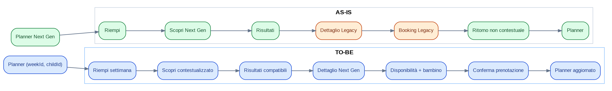

### Frizioni AS-IS

  - > Perdita di weekId/childId

  - > Cambio shell e navigazione

  - > Ritorno al Planner non deterministico

  - > Impossibilità di misurare una funnel unica

### Business rule principali

  - > BR-J01-01 La ricerca aperta dal Planner deve ricevere weekId e childId quando disponibili.

  - > BR-J01-02 I risultati devono escludere incompatibilità bloccanti e spiegare quelle non bloccanti.

  - > BR-J01-03 La disponibilità deve essere verificata prima della conferma.

  - > BR-J01-04 Una prenotazione confermata deve aggiornare il Planner in modo idempotente.

  - > BR-J01-05 L’utente deve poter tornare ai risultati senza perdere filtri e posizione.

### KPI journey

  - > Conversione Planner -\> prenotazione

  - > Tempo per coprire una settimana

  - > Drop-off per step

  - > Legacy exposure rate

**6.2 J02 - Scoprire, confrontare e salvare attività**

| **Campo**      | **Contenuto**                                                    |
| -------------- | ---------------------------------------------------------------- |
| Obiettivo      | Esplorare opportunità da Home o Scopri, confrontarle e salvarle. |
| Trigger        | Bisogno esplorativo, suggerimento Home o ricerca libera.         |
| Change Request | CR-009, CR-010, CR-017, CR-018, CR-019, CR-043, CR-047           |

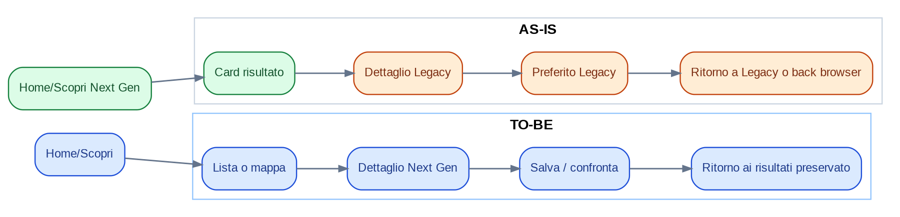

### Frizioni AS-IS

  - > Dettaglio e preferiti fuori shell

  - > Gerarchia informativa variabile

  - > Back non garantisce stato

  - > Test data visibili nei risultati

### Business rule principali

  - > BR-J02-01 Lista e mappa devono condividere filtri e ordinamento.

  - > BR-J02-02 Il salvataggio deve essere disponibile da card e dettaglio con stato sincronizzato.

  - > BR-J02-03 Il risultato deve distinguere match, disponibilità e prezzo.

  - > BR-J02-04 Dati test non devono essere visibili in ambienti non di test.

  - > BR-J02-05 Il back deve ripristinare scroll e filtri.

### KPI journey

  - > CTR risultato -\> dettaglio

  - > Save rate

  - > Ritorno ai risultati senza reset

  - > Zero test data in produzione

**6.3 J03 - Gestire copertura e viste del Planner**

| **Campo**      | **Contenuto**                                                                   |
| -------------- | ------------------------------------------------------------------------------- |
| Obiettivo      | Visualizzare e modificare la copertura familiare per settimana, mese e bambino. |
| Trigger        | Controllo pianificazione o necessità di colmare gap.                            |
| Change Request | CR-005, CR-021, CR-022, CR-023, CR-026, CR-035                                  |

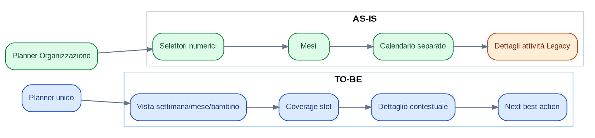

### Frizioni AS-IS

  - > Modi e responsabilità non espliciti

  - > Calendario sembra pagina distinta

  - > Dettaglio pianificato apre catalogo

  - > CTA multiple con pari peso

### Business rule principali

  - > BR-J03-01 Organizzazione e Calendario sono viste dello stesso stato Planner.

  - > BR-J03-02 Ogni slot deve avere stato scoperto, parziale o coperto.

  - > BR-J03-03 Il dettaglio di un elemento pianificato apre prima la prenotazione, poi l’attività.

  - > BR-J03-04 Il Planner deve mostrare una CTA primaria coerente con lo stato.

  - > BR-J03-05 I filtri di vista non modificano i dati, solo la rappresentazione.

### KPI journey

  - > Planner weekly active families

  - > Coverage completion rate

  - > Tempo di orientamento

  - > Backtrack tra viste

**6.4 J04 - Gestire il ciclo di vita della prenotazione**

| **Campo**      | **Contenuto**                                                 |
| -------------- | ------------------------------------------------------------- |
| Obiettivo      | Consultare, filtrare e gestire ciò che è stato acquistato.    |
| Trigger        | Conferma, modifica, necessità informativa o contatto gestore. |
| Change Request | CR-002, CR-034, CR-035, CR-037, CR-044, CR-045                |

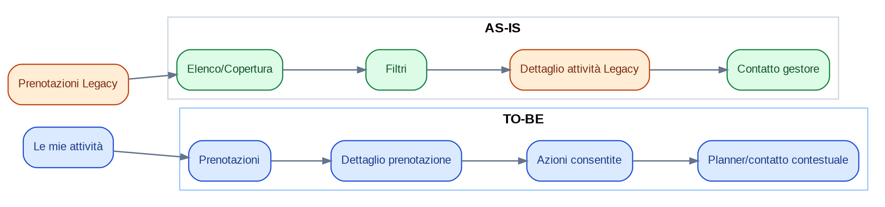

### Frizioni AS-IS

  - > Sezione nel profilo e nella nav

  - > Dettaglio attività sostituisce dettaglio booking

  - > Link Planner punta a root Legacy

  - > Shell e filtri incoerenti

### Business rule principali

  - > BR-J04-01 La prenotazione è l’oggetto primario post-acquisto.

  - > BR-J04-02 Le azioni dipendono dallo stato e dalle policy del gestore.

  - > BR-J04-03 Ogni booking deve mostrare bambini, periodo, prezzo, centro e stato.

  - > BR-J04-04 I cambi di stato devono aggiornare Planner e notifiche.

  - > BR-J04-05 Il contatto gestore deve mantenere il riferimento alla prenotazione.

### KPI journey

  - > Self-service completion

  - > Contatti supporto per booking

  - > Tempo per trovare una prenotazione

  - > Booking detail success rate

**6.5 J05 - Consultare e correggere le presenze**

| **Campo**      | **Contenuto**                                              |
| -------------- | ---------------------------------------------------------- |
| Obiettivo      | Vedere presenze, ritardi e assenze per bambino e attività. |
| Trigger        | Verifica giornaliera, contestazione o storico.             |
| Change Request | CR-036, CR-037, CR-044, CR-045                             |

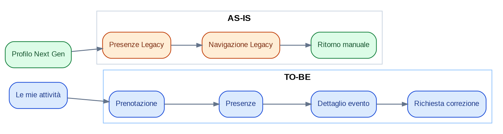

### Frizioni AS-IS

  - > Presenze scollegate dalla prenotazione

  - > Pagina Legacy minima

  - > Nessun percorso di correzione esplicito

  - > Ownership informativa ambiguo

### Business rule principali

  - > BR-J05-01 Ogni presenza è riferita a booking, data e bambino.

  - > BR-J05-02 Le correzioni devono generare una richiesta tracciata.

  - > BR-J05-03 Lo storico deve essere filtrabile per bambino e periodo.

  - > BR-J05-04 Stati ammessi: presente, assente, ritardo, uscita anticipata, da verificare.

### KPI journey

  - > Consultazione presenze

  - > Richieste correzione risolte

  - > Tempo medio di risoluzione

  - > Errori di attribuzione

**6.6 J06 - Creare e gestire la famiglia condivisa**

| **Campo**      | **Contenuto**                                                       |
| -------------- | ------------------------------------------------------------------- |
| Obiettivo      | Creare il nucleo, aggiungere bambini e coinvolgere un altro adulto. |
| Trigger        | Prima configurazione o necessità di collaborazione.                 |
| Change Request | CR-003, CR-027, CR-028, CR-044, CR-046                              |

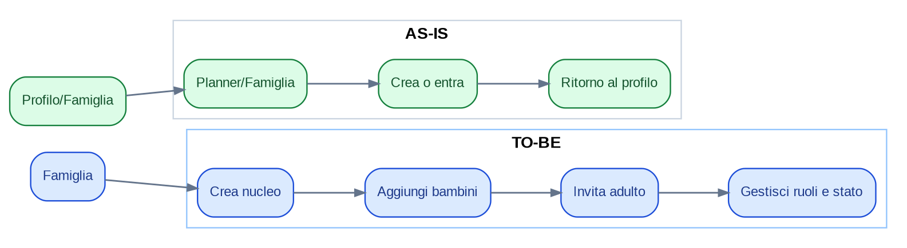

### Frizioni AS-IS

  - > Route sotto Planner, ingresso da Profilo

  - > Nessun modello ruoli esplicito

  - > Creazione e join senza stato lifecycle

  - > Doppia collocazione concettuale

### Business rule principali

  - > BR-J06-01 Un utente può appartenere a uno o più nuclei solo se previsto dal modello.

  - > BR-J06-02 L’invito deve avere scadenza, revoca e stato.

  - > BR-J06-03 I ruoli minimi sono owner e membro adulto.

  - > BR-J06-04 Le modifiche critiche devono essere auditabili.

  - > BR-J06-05 La visibilità sui bambini dipende dalla membership attiva.

### KPI journey

  - > Household setup completion

  - > Invite acceptance rate

  - > Tempo di configurazione

  - > Famiglie con almeno due adulti

**6.7 J07 - Configurare indirizzi e promemoria logistici**

| **Campo**      | **Contenuto**                                                             |
| -------------- | ------------------------------------------------------------------------- |
| Obiettivo      | Definire punti di partenza e ricevere avvisi utili per arrivare in tempo. |
| Trigger        | Nuova famiglia, nuova prenotazione o modifica logistica.                  |
| Change Request | CR-029, CR-030, CR-031, CR-039, CR-044                                    |

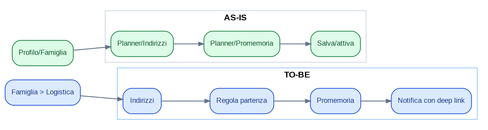

### Frizioni AS-IS

  - > Dati logistici sotto route Planner

  - > Regole non esplicite

  - > Promemoria presentato come anteprima

  - > Nessun fallback su travel time

### Business rule principali

  - > BR-J07-01 Un indirizzo può essere casa, lavoro o personalizzato.

  - > BR-J07-02 Un solo indirizzo può essere default per contesto.

  - > BR-J07-03 Il promemoria deve dichiarare origine, evento, anticipo e canale.

  - > BR-J07-04 Se il travel time non è disponibile, usare un anticipo configurabile.

  - > BR-J07-05 Le notifiche devono rispettare consensi e quiet hours.

### KPI journey

  - > Address completion

  - > Reminder activation

  - > On-time interaction rate

  - > Notification opt-out

**6.8 J08 - Condividere il piano con nonni o caregiver**

| **Campo**      | **Contenuto**                                               |
| -------------- | ----------------------------------------------------------- |
| Obiettivo      | Condividere una vista di sola lettura per settimana o mese. |
| Trigger        | Necessità di coordinamento esterno al nucleo autenticato.   |
| Change Request | CR-032, CR-033, CR-041, CR-044, CR-047                      |

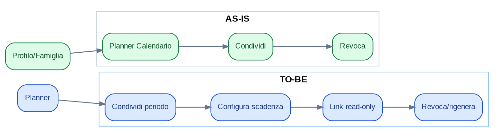

### Frizioni AS-IS

  - > Funzione collocata in due aree

  - > Ambito e scadenza non visibili

  - > Rischio privacy se link non governato

  - > Nessuna telemetria d’uso

### Business rule principali

  - > BR-J08-01 Il link è di sola lettura e limitato al periodo scelto.

  - > BR-J08-02 Deve avere token non prevedibile, revoca e opzionale scadenza.

  - > BR-J08-03 Dati sensibili non necessari devono essere esclusi.

  - > BR-J08-04 La rigenerazione invalida il link precedente.

  - > BR-J08-05 Il proprietario vede stato e ultimo accesso aggregato.

### KPI journey

  - > Share link creation

  - > Link usage

  - > Revocation success

  - > Privacy incidents

**6.9 J09 - Contattare il gestore e gestire richieste**

| **Campo**      | **Contenuto**                                                |
| -------------- | ------------------------------------------------------------ |
| Obiettivo      | Aprire una richiesta contestuale e seguirne la risposta.     |
| Trigger        | Domanda pre-booking, problema booking o correzione presenza. |
| Change Request | CR-020, CR-037, CR-044, CR-045                               |

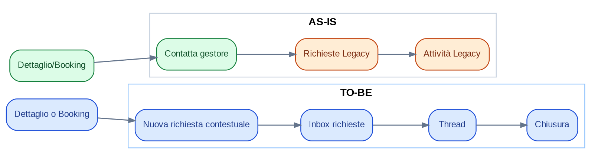

### Frizioni AS-IS

  - > Richieste separate dal contesto

  - > Mancanza di thread/stati osservabili

  - > Ingresso da più punti senza taxonomy

  - > Ritorno in Legacy

### Business rule principali

  - > BR-J09-01 Ogni richiesta ha tipo, oggetto correlato e stato.

  - > BR-J09-02 Le richieste pre-booking riferiscono l’attività; post-booking la prenotazione.

  - > BR-J09-03 Stati: aperta, risposta ricevuta, in attesa utente, chiusa.

  - > BR-J09-04 Le notifiche devono aprire direttamente il thread.

### KPI journey

  - > Time to first response

  - > Open request rate

  - > Resolution time

  - > Requests without context

**6.10 J10 - Gestire account, preferenze, privacy e feedback**

| **Campo**      | **Contenuto**                                                            |
| -------------- | ------------------------------------------------------------------------ |
| Obiettivo      | Configurare l’esperienza e governare sicurezza, consensi e segnalazioni. |
| Trigger        | Aggiornamento profilo, password, preferenze, privacy o invio issue.      |
| Change Request | CR-004, CR-039, CR-040, CR-041, CR-042, CR-046, CR-047                   |

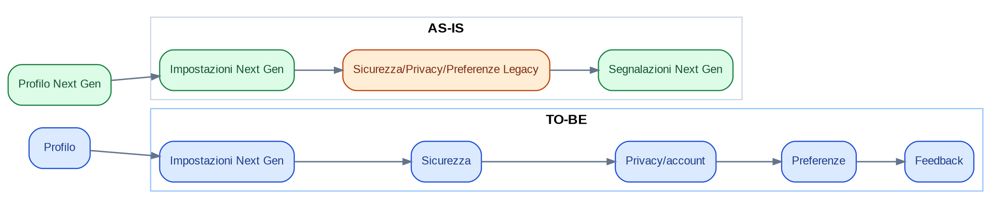

### Frizioni AS-IS

  - > Tre pagine core ancora Legacy

  - > Azioni account ad alto rischio senza journey evidente

  - > Feedback beta mescolato al profilo

  - > Doppia shell

### Business rule principali

  - > BR-J10-01 Le azioni distruttive richiedono conferma forte e informativa.

  - > BR-J10-02 La cancellazione segue uno stato e una retention policy.

  - > BR-J10-03 Preferenze lingua/tema/notifiche sono centralizzate.

  - > BR-J10-04 Le segnalazioni hanno categoria, severità e stato.

  - > BR-J10-05 Le pagine di sicurezza non devono dipendere dalla shell Legacy.

### KPI journey

  - > Settings task success

  - > Password update success

  - > Account action abandonment

  - > Issue resolution SLA

**7. Business Rules Catalog**

*Regole funzionali e di controllo per processo*

Il catalogo comprende 58 regole specifiche di journey e 10 regole trasversali. Ogni regola è classificata per vincolo e owner, così da poter essere trasformata in acceptance criteria e test automatici.

| **Lettura del catalogo**                                                                                                                                                                                             |
| -------------------------------------------------------------------------------------------------------------------------------------------------------------------------------------------------------------------- |
| Le regole Must sono condizioni di rilascio. Le regole Should possono essere differite solo con DDL e rischio accettato. L’owner indicato è responsabile della validazione, non necessariamente dell’implementazione. |

| **ID**    | **Journey** | **Regola**                                                                                                                                                                              | **Vincolo** | **Owner**                     |
| --------- | ----------- | --------------------------------------------------------------------------------------------------------------------------------------------------------------------------------------- | ----------- | ----------------------------- |
| BR-J01-01 | J01         | La ricerca aperta dal Planner deve ricevere weekId e childId quando disponibili.                                                                                                        | Must        | Product + IT                  |
| BR-J01-02 | J01         | I risultati devono escludere incompatibilità bloccanti e spiegare quelle non bloccanti.                                                                                                 | Must        | Product + IT                  |
| BR-J01-03 | J01         | La disponibilità deve essere verificata prima della conferma.                                                                                                                           | Must        | Product + IT                  |
| BR-J01-04 | J01         | Una prenotazione confermata deve aggiornare il Planner in modo idempotente.                                                                                                             | Must        | Product + IT                  |
| BR-J01-05 | J01         | L’utente deve poter tornare ai risultati senza perdere filtri e posizione.                                                                                                              | Must        | Product + IT                  |
| BR-J02-01 | J02         | Lista e mappa devono condividere filtri e ordinamento.                                                                                                                                  | Must        | Product + IT                  |
| BR-J02-02 | J02         | Il salvataggio deve essere disponibile da card e dettaglio con stato sincronizzato.                                                                                                     | Must        | Product + IT                  |
| BR-J02-03 | J02         | Il risultato deve distinguere match, disponibilità e prezzo.                                                                                                                            | Must        | Product + IT                  |
| BR-J02-04 | J02         | Dati test non devono essere visibili in ambienti non di test.                                                                                                                           | Must        | Product + IT                  |
| BR-J02-05 | J02         | Il back deve ripristinare scroll e filtri.                                                                                                                                              | Must        | Product + IT                  |
| BR-J03-01 | J03         | Organizzazione e Calendario sono viste dello stesso stato Planner.                                                                                                                      | Must        | Product + IT                  |
| BR-J03-02 | J03         | Ogni slot deve avere stato scoperto, parziale o coperto.                                                                                                                                | Must        | Product + IT                  |
| BR-J03-03 | J03         | Il dettaglio di un elemento pianificato apre prima la prenotazione, poi l’attività.                                                                                                     | Must        | Product + IT                  |
| BR-J03-04 | J03         | Il Planner deve mostrare una CTA primaria coerente con lo stato.                                                                                                                        | Must        | Product + IT                  |
| BR-J03-05 | J03         | I filtri di vista non modificano i dati, solo la rappresentazione.                                                                                                                      | Must        | Product + IT                  |
| BR-J04-01 | J04         | La prenotazione è l’oggetto primario post-acquisto.                                                                                                                                     | Must        | Product + IT                  |
| BR-J04-02 | J04         | Le azioni dipendono dallo stato e dalle policy del gestore.                                                                                                                             | Must        | Product + IT                  |
| BR-J04-03 | J04         | Ogni booking deve mostrare bambini, periodo, prezzo, centro e stato.                                                                                                                    | Must        | Product + IT                  |
| BR-J04-04 | J04         | I cambi di stato devono aggiornare Planner e notifiche.                                                                                                                                 | Must        | Product + IT                  |
| BR-J04-05 | J04         | Il contatto gestore deve mantenere il riferimento alla prenotazione.                                                                                                                    | Must        | Product + IT                  |
| BR-J05-01 | J05         | Ogni presenza è riferita a booking, data e bambino.                                                                                                                                     | Must        | Product + IT                  |
| BR-J05-02 | J05         | Le correzioni devono generare una richiesta tracciata.                                                                                                                                  | Must        | Product + IT                  |
| BR-J05-03 | J05         | Lo storico deve essere filtrabile per bambino e periodo.                                                                                                                                | Must        | Product + IT                  |
| BR-J05-04 | J05         | Stati ammessi: presente, assente, ritardo, uscita anticipata, da verificare.                                                                                                            | Must        | Product + IT                  |
| BR-J06-01 | J06         | Un utente può appartenere a uno o più nuclei solo se previsto dal modello.                                                                                                              | Must        | Product + IT                  |
| BR-J06-02 | J06         | L’invito deve avere scadenza, revoca e stato.                                                                                                                                           | Must        | Product + IT                  |
| BR-J06-03 | J06         | I ruoli minimi sono owner e membro adulto.                                                                                                                                              | Must        | Product + IT                  |
| BR-J06-04 | J06         | Le modifiche critiche devono essere auditabili.                                                                                                                                         | Must        | Product + IT                  |
| BR-J06-05 | J06         | La visibilità sui bambini dipende dalla membership attiva.                                                                                                                              | Must        | Product + IT                  |
| BR-J07-01 | J07         | Un indirizzo può essere casa, lavoro o personalizzato.                                                                                                                                  | Must        | Product + IT                  |
| BR-J07-02 | J07         | Un solo indirizzo può essere default per contesto.                                                                                                                                      | Must        | Product + IT                  |
| BR-J07-03 | J07         | Il promemoria deve dichiarare origine, evento, anticipo e canale.                                                                                                                       | Must        | Product + IT                  |
| BR-J07-04 | J07         | Se il travel time non è disponibile, usare un anticipo configurabile.                                                                                                                   | Must        | Product + IT                  |
| BR-J07-05 | J07         | Le notifiche devono rispettare consensi e quiet hours.                                                                                                                                  | Must        | Product + IT                  |
| BR-J08-01 | J08         | Il link è di sola lettura e limitato al periodo scelto.                                                                                                                                 | Must        | Product + IT                  |
| BR-J08-02 | J08         | Deve avere token non prevedibile, revoca e opzionale scadenza.                                                                                                                          | Must        | Product + IT                  |
| BR-J08-03 | J08         | Dati sensibili non necessari devono essere esclusi.                                                                                                                                     | Must        | Product + IT                  |
| BR-J08-04 | J08         | La rigenerazione invalida il link precedente.                                                                                                                                           | Must        | Product + IT                  |
| BR-J08-05 | J08         | Il proprietario vede stato e ultimo accesso aggregato.                                                                                                                                  | Must        | Product + IT                  |
| BR-J09-01 | J09         | Ogni richiesta ha tipo, oggetto correlato e stato.                                                                                                                                      | Must        | Product + IT                  |
| BR-J09-02 | J09         | Le richieste pre-booking riferiscono l’attività; post-booking la prenotazione.                                                                                                          | Must        | Product + IT                  |
| BR-J09-03 | J09         | Stati: aperta, risposta ricevuta, in attesa utente, chiusa.                                                                                                                             | Must        | Product + IT                  |
| BR-J09-04 | J09         | Le notifiche devono aprire direttamente il thread.                                                                                                                                      | Must        | Product + IT                  |
| BR-J10-01 | J10         | Le azioni distruttive richiedono conferma forte e informativa.                                                                                                                          | Must        | Product + IT                  |
| BR-J10-02 | J10         | La cancellazione segue uno stato e una retention policy.                                                                                                                                | Must        | Product + IT                  |
| BR-J10-03 | J10         | Preferenze lingua/tema/notifiche sono centralizzate.                                                                                                                                    | Must        | Product + IT                  |
| BR-J10-04 | J10         | Le segnalazioni hanno categoria, severità e stato.                                                                                                                                      | Must        | Product + IT                  |
| BR-J10-05 | J10         | Le pagine di sicurezza non devono dipendere dalla shell Legacy.                                                                                                                         | Must        | Product + IT                  |
| BR-X-01   | Cross       | Ogni route target deve essere accessibile con deep link e autorizzazione coerente.                                                                                                      | Must        | IT                            |
| BR-X-02   | Cross       | Le azioni idempotenti non devono generare duplicati in caso di retry.                                                                                                                   | Must        | Backend                       |
| BR-X-03   | Cross       | Ogni errore deve avere codice tecnico, messaggio utente e correlationId.                                                                                                                | Must        | IT/QA                         |
| BR-X-04   | Cross       | Le CTA non disponibili devono spiegare il requisito mancante.                                                                                                                           | Should      | UX/Product                    |
| BR-X-05   | Cross       | Le entità test sono escluse dalle coorti reali e dagli analytics business.                                                                                                              | Must        | Data/Platform                 |
| BR-X-06   | Cross       | Ogni cambio di stato critico genera audit trail con attore e timestamp.                                                                                                                 | Must        | Backend/Security              |
| BR-X-07   | Cross       | I dati personali condivisi devono rispettare minimizzazione e scope.                                                                                                                    | Must        | Legal/Security                |
| BR-X-08   | Cross       | Il context object deve essere versionato e retrocompatibile durante la migrazione.                                                                                                      | Must        | Frontend/Backend              |
| BR-X-09   | Cross       | Il browser back deve ripristinare stato e non avviare nuove transazioni.                                                                                                                | Should      | Frontend                      |
| BR-X-10   | Cross       | Le pagine devono esporre una sola primary CTA per stato.                                                                                                                                | Should      | UX                            |
| BR-J11-01 | J11         | Una segnalazione di centro non iscritto deve generare un CenterLead e non una scheda attività pubblica o prenotabile.                                                                   | Must        | Product + Partner Ops + IT    |
| BR-J11-02 | J11         | Il lead deve conservare il contesto di domanda: route sorgente, località, periodo/settimana, filtri e fascia d’età quando disponibili.                                                  | Must        | Product + Data                |
| BR-J11-03 | J11         | Prima dell’outreach il sistema o l’Admin deve verificare duplicati su nome, indirizzo, dominio e contatti disponibili.                                                                  | Must        | Admin Ops + Backend           |
| BR-J11-04 | J11         | L’eventuale invito deve usare un token tracciabile, revocabile e con scadenza; il centro deve completare registrazione, verifica e pubblicazione prima di essere visibile come offerta. | Must        | Security + Partner + IT       |
| BR-J11-05 | J11         | La raccolta e l’uso di contatti di terzi devono essere minimizzati e sottoposti a verifica Legal/Privacy prima del pilot.                                                               | Must        | Legal + Product               |
| BR-J12-01 | J12         | La floating CTA deve essere governata da feature flag/coorte beta e non deve diventare una dipendenza permanente della navigazione primaria.                                            | Must        | Product + Frontend            |
| BR-J12-02 | J12         | Ogni feedback deve acquisire automaticamente route, timestamp, versione applicativa e context object disponibile, senza precompilare dati sensibili nel testo libero.                   | Must        | Product + Data + Security     |
| BR-J12-03 | J12         | Il feedback deve essere classificabile almeno come bug, contenuto/dato, difficoltà di utilizzo o proposta; ogni item deve avere stato di triage e owner.                                | Must        | Product Ops + Admin           |
| BR-J12-04 | J12         | La CTA beta non sostituisce i canali operativi per richieste su prenotazioni, pagamenti o sicurezza; tali casi devono essere instradati al workflow appropriato.                        | Must        | Product + Support             |
| BR-J12-05 | J12         | La misurazione deve distinguere apertura CTA, invio, feedback azionabile, duplicato, preso in carico e risolto.                                                                         | Should      | Product + Data                |
| BR-J11-06 | J11         | La sola segnalazione non genera sconto o credito; il reward richiede Partner approvato, attività pubblicata e primo booking confermato con il centro referral.                          | Must        | Product + Growth + Finance    |
| BR-J11-07 | J11         | Il reward Genitore proposto è 10% fino a 25 euro sul primo booking con il centro, one-shot, scadenza 6 mesi e non cumulabile salvo regola esplicita.                                    | Proposed    | Business + Product            |
| BR-J11-08 | J11         | L’attribution economica è assegnata al primo suggerimento qualificato precedente a registrazione o claim; duplicati restano DemandContext senza reward multipli.                        | Must        | Growth + Admin Ops + IT       |
| BR-J11-09 | J11         | Il Genitore può seguire gli stati ricevuto, qualificato, invitato, onboarding, attivo e reward earned/redeemed senza vedere dati riservati del Partner.                                 | Should      | Product + UX                  |
| BR-J11-10 | J11         | Il Partner referral accede a 3% anziché 5% per 50 booking o 12 mesi solo se mantiene profilo ≥90%, SLA ≥80%, disponibilità fresca ≥90% e cancellazioni \<5%.                            | Proposed    | Business + Partner Ops        |
| BR-J11-11 | J11         | Self-referral, relazioni tra referrer e organizzazione, duplicati e pattern anomali devono poter sospendere attribution, reward o incentivo.                                            | Must        | Risk + Admin Ops              |
| BR-J11-12 | J11         | Regole, soglie, budget, durata e versioni del programma sono configurabili e auditabili; nessun trattamento economico è hardcoded nella UI.                                             | Must        | Admin + Finance + IT          |
| BR-J11-13 | J11         | Nel beta senza checkout reale, reward e commissioni possono essere calcolati in shadow mode o applicati manualmente, mantenendo eligibility e audit.                                    | Should      | Product + Finance + Admin Ops |

**8. Information Architecture TO-BE**

*Struttura proposta e motivazioni*

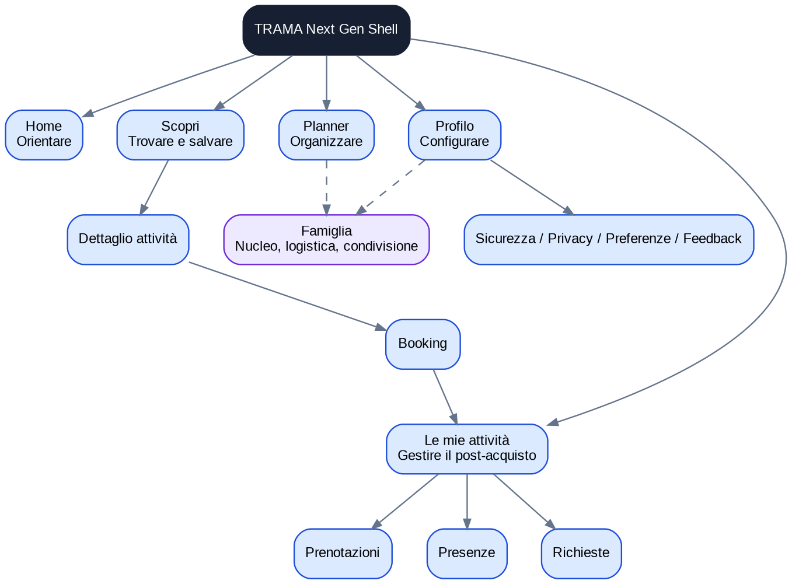

## 8.1 Navigazione primaria proposta

| **Voce**        | **Domanda utente**                      | **Contenuto**                                       |
| --------------- | --------------------------------------- | --------------------------------------------------- |
| Home            | Cosa richiede attenzione oggi?          | Riepilogo, suggerimenti, next best action.          |
| Planner         | Come è organizzata la famiglia?         | Copertura, calendario, viste, budget/gruppi.        |
| Scopri          | Cosa posso trovare e salvare?           | Ricerca, mappa, filtri, salvati, dettaglio.         |
| Le mie attività | Cosa ho acquistato e cosa devo gestire? | Prenotazioni, presenze, richieste.                  |
| Profilo         | Come configuro account e applicazione?  | Identità, preferenze, sicurezza, privacy, feedback. |

## 8.2 Motivazioni

  - > Riduce le cinque principali ambiguità di ownership osservate.

  - > Mantiene entro cinque voci la navigazione mobile primaria.

  - > Separa chiaramente pre-acquisto, pianificazione e post-acquisto.

  - > Consente a Famiglia di rimanere una capability trasversale senza occupare una tab quotidiana.

  - > Rende ogni route compatibile con analytics, autorizzazioni e test per dominio.

## 8.3 Target route map

| **AS-IS**                        | **TO-BE proposta**            | **Trattamento**      |
| -------------------------------- | ----------------------------- | -------------------- |
| /nextgen                         | /app/home                     | Redirect compatibile |
| /nextgen/planner                 | /app/planner                  | Owner Planner        |
| /nextgen/planner?mode=calendario | /app/planner?view=calendar    | Stesso stato         |
| /nextgen/search                  | /app/discover                 | Owner Scopri         |
| /activity/:slug                  | /app/discover/activity/:slug  | Redirect e resolver  |
| /booking/:slug                   | /app/booking/:draftId         | Nuovo booking        |
| /prenotazioni                    | /app/my-activities/bookings   | Migrazione           |
| /presenze                        | /app/my-activities/attendance | Migrazione           |
| /richieste                       | /app/my-activities/requests   | Migrazione           |
| /preferiti                       | /app/discover/saved           | Migrazione           |
| /nextgen/profile                 | /app/profile                  | Refocus              |
| /nextgen/profile/famiglia        | /app/family                   | Nuovo dominio        |
| /nextgen/planner/indirizzi       | /app/family/addresses         | Migrazione           |
| /nextgen/planner/promemoria      | /app/family/reminders         | Migrazione           |
| /profile/preferenze              | /app/profile/preferences      | Migrazione           |
| /profile/privacy                 | /app/profile/privacy          | Migrazione           |
| /profile/sicurezza               | /app/profile/security         | Migrazione           |

**9. Domain Model e ownership dei dati**

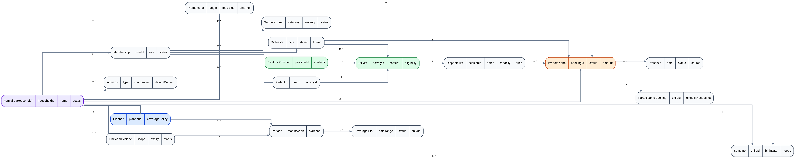

*Il modello separa aggregate e responsabilità. Il Planner non possiede attività o prenotazioni: conserva riferimenti e stato di copertura. Il Booking possiede lo stato contrattuale. Famiglia possiede membership, bambini e logistica.*

## 9.1 Aggregate roots e owner

| **Aggregate**      | **Entità**                                              | **Owner logico**                    |
| ------------------ | ------------------------------------------------------- | ----------------------------------- |
| Famiglia           | Household, Membership, Bambino, Indirizzo               | Family service / domain             |
| Planner            | Periodo, Coverage Slot, riferimenti a booking           | Planner service / domain            |
| Catalogo           | Provider, Attività, Disponibilità                       | Discovery/Catalog service           |
| Booking            | Prenotazione, Partecipante, pagamento/stato             | Booking service                     |
| Operations         | Presenza, Richiesta/Thread                              | Operations/Communication            |
| Engagement         | Preferito, Promemoria, Share link, Notifica             | Cross-domain services               |
| Account            | Utente, Preferenze, Consensi, Segnalazione              | Identity/Profile                    |
| Supply acquisition | CenterLead, CenterInvitation, CenterClaim, Outreach     | Growth / Partner onboarding domain  |
| Beta feedback      | BetaFeedback, FeedbackContext, TriageStatus, Resolution | Product Operations / Support domain |

## 9.2 Stati minimi

| **Oggetto**       | **State machine**                                                                                            |
| ----------------- | ------------------------------------------------------------------------------------------------------------ |
| Booking           | draft -\> pending -\> confirmed -\> completed | cancelled | refunded                                         |
| Membership invite | pending -\> accepted | expired | revoked                                                                     |
| Inquiry           | open -\> replied -\> waiting\_user -\> closed                                                                |
| Share link        | active -\> expired | revoked                                                                                 |
| Issue report      | submitted -\> triaged -\> in\_progress -\> resolved | rejected                                               |
| Account deletion  | requested -\> cooling\_off -\> cancelled | deleted                                                           |
| CenterLead        | suggested -\> deduplicated -\> qualified -\> invited/contacted -\> claimed | rejected | expired              |
| Center onboarding | claimed -\> registration\_in\_progress -\> submitted -\> approved | changes\_requested | rejected -\> active |
| BetaFeedback      | submitted -\> triaged -\> planned | duplicate | not\_actionable -\> resolved -\> closed                      |

## 9.3 Eventi di dominio raccomandati

  - > booking.confirmed / booking.cancelled / booking.updated

  - > planner.coverage\_changed / planner.period\_shared

  - > household.member\_invited / household.member\_joined

  - > attendance.recorded / attendance.correction\_requested

  - > inquiry.created / inquiry.replied / inquiry.closed

  - > reminder.scheduled / reminder.sent / reminder.failed

  - > account.deletion\_requested / account.deleted

**10. Matrice Processi x Pagine x Responsabilità**

Legenda: O = owner del processo; E = entry point; S = supporto/consultazione; X = cambio di contesto Legacy; - = non coinvolta.

  - > Nel TO-BE ogni journey ha un solo owner.

  - > Entry point e supporto possono essere multipli, ma non duplicano lo stato.

  - > La colonna Legacy rappresenta debito da azzerare entro Gate C.

| **Journey**              | **Home** | **Planner** | **Scopri** | **Detail** | **Booking** | **Le mie attività** | **Famiglia** | **Profilo** | **Legacy** |
| ------------------------ | -------- | ----------- | ---------- | ---------- | ----------- | ------------------- | ------------ | ----------- | ---------- |
| J01 Ricerca da settimana | E        | O           | S          | S          | S           | \-                  | S            | \-          | X          |
| J02 Discovery e salvati  | E        | \-          | O          | S          | \-          | \-                  | \-           | \-          | X          |
| J03 Copertura Planner    | E        | O           | S          | S          | S           | S                   | S            | \-          | X          |
| J04 Gestione booking     | E        | S           | \-         | S          | S           | O                   | \-           | E           | X          |
| J05 Presenze             | \-       | S           | \-         | \-         | S           | O                   | S            | E           | X          |
| J06 Famiglia condivisa   | \-       | S           | \-         | \-         | \-          | \-                  | O            | E           | \-         |
| J07 Logistica e reminder | \-       | S           | \-         | \-         | S           | \-                  | O            | E           | \-         |
| J08 Condivisione piano   | \-       | O           | \-         | \-         | \-          | \-                  | S            | E           | \-         |
| J09 Richieste            | \-       | \-          | S          | S          | S           | O                   | \-           | E           | X          |
| J10 Account e feedback   | \-       | \-          | \-         | \-         | \-          | \-                  | \-           | O           | X          |

**Nota: la colonna Legacy evidenzia il problema AS-IS; nel TO-BE deve risultare “-” per tutte le journey.**

## 10.1 Matrice tecnica per route owner

| **Capability**  | **Route**                    | **Dipendenza tecnica**           | **Responsabilità**        |
| --------------- | ---------------------------- | -------------------------------- | ------------------------- |
| Home            | /app/home                    | Home BFF / analytics             | Nessun dato transazionale |
| Planner         | /app/planner                 | Planner API + booking references | Coverage e viste          |
| Scopri          | /app/discover                | Catalog/Search API               | Ricerca e filtri          |
| Activity Detail | /app/discover/activity/:slug | Catalog + Availability           | Pre-booking               |
| Booking         | /app/booking/:id             | Booking API                      | Transazione               |
| Le mie attività | /app/my-activities/\*        | Booking/Attendance/Inquiry       | Post-acquisto             |
| Famiglia        | /app/family/\*               | Household/Address/Reminder       | Dati nucleo               |
| Profilo         | /app/profile/\*              | Identity/Consent/Issue           | Configurazione            |

**11. Change Request Backlog**

50 change request con priorità, dipendenze e sprint

Il backlog è ordinato per ID e strutturato per capability. La priorità esprime il rischio/valore; la taglia è indicativa e deve essere raffinata dal team tecnico. Ogni CR deve essere ulteriormente scomposta in user story e task solo dopo approvazione del relativo DDL.

| **ID** | **Titolo**                                                                      | **Area**            | **Prio** | **Size** | **Owner**                          | **Dipendenze**                                        | **Sprint**                                   |
| ------ | ------------------------------------------------------------------------------- | ------------------- | -------- | -------- | ---------------------------------- | ----------------------------------------------------- | -------------------------------------------- |
| CR-001 | Definire IA e navigazione primaria TO-BE                                        | Architecture        | P0       | M        | Product/UX                         | \-                                                    | S6                                           |
| CR-002 | Creare macro-area “Le mie attività”                                             | Architecture        | P1       | M        | Product/UX                         | CR-001                                                | S11                                          |
| CR-003 | Rendere Famiglia una capability autonoma                                        | Architecture        | P1       | M        | Product/UX                         | CR-001                                                | S10                                          |
| CR-004 | Rifocalizzare Profilo su identità e configurazione                              | Architecture        | P1       | S        | Product/UX                         | CR-001, CR-002, CR-003                                | S11                                          |
| CR-005 | Integrare Calendario come modalità del Planner                                  | Planner             | P1       | M        | Product/Frontend                   | CR-001, CR-022                                        | S9                                           |
| CR-006 | Introdurre context object di journey (source, weekId, childId, filters)         | Platform            | P0       | M        | Product/Frontend                   | CR-001                                                | S6                                           |
| CR-007 | Applicare una shell Next Gen unica a tutte le route target                      | Platform            | P0       | L        | Frontend                           | CR-001                                                | S6-S12                                       |
| CR-008 | Gestire redirect e deep link delle route Legacy                                 | Migration           | P0       | M        | Frontend/Backend                   | CR-007                                                | S6-S12                                       |
| CR-009 | Realizzare dettaglio attività Next Gen                                          | Discovery           | P0       | L        | Product/UX/Frontend                | CR-007                                                | S7                                           |
| CR-010 | Definire content contract del dettaglio attività                                | Discovery           | P0       | M        | Product/Backend                    | \-                                                    | S7                                           |
| CR-011 | Integrare disponibilità e capacità nel dettaglio                                | Booking             | P0       | L        | Backend/Frontend                   | CR-009, CR-010                                        | S7                                           |
| CR-012 | Integrare selezione bambino e verifica idoneità                                 | Booking             | P0       | M        | Backend/Frontend                   | CR-009, CR-027                                        | S7-S8                                        |
| CR-013 | Realizzare booking flow Next Gen                                                | Booking             | P0       | XL       | Product/UX/IT                      | CR-011, CR-012                                        | S8                                           |
| CR-014 | Realizzare conferma, riepilogo ed esito prenotazione                            | Booking             | P0       | M        | Frontend/Backend                   | CR-013                                                | S8                                           |
| CR-015 | Aggiornare automaticamente il Planner dopo conferma/cambio booking              | Integration         | P0       | L        | Backend/Frontend                   | CR-013, CR-021                                        | S8-S9                                        |
| CR-016 | Contestualizzare Scopri quando aperto dal Planner                               | Discovery           | P0       | M        | Frontend/Backend                   | CR-006, CR-017                                        | S8                                           |
| CR-017 | Standardizzare filtri, ordinamento e stato lista/mappa                          | Discovery           | P1       | M        | Product/UX/Frontend                | CR-006                                                | S7                                           |
| CR-018 | Ridisegnare gerarchia informativa delle card risultato                          | Discovery           | P1       | M        | UX/Frontend                        | CR-010                                                | S7                                           |
| CR-019 | Uniformare preferiti/salvati tra card, dettaglio e lista                        | Discovery           | P1       | M        | Frontend/Backend                   | CR-009                                                | S7                                           |
| CR-020 | Integrare contatto gestore/richiesta contestuale                                | Communication       | P1       | L        | Product/Backend/Frontend           | CR-009, CR-037                                        | S11                                          |
| CR-021 | Formalizzare modello di copertura del Planner                                   | Planner             | P0       | L        | Product/Backend                    | CR-006                                                | S9                                           |
| CR-022 | Unificare stato Organizzazione/Calendario                                       | Planner             | P0       | L        | Frontend/Backend                   | CR-021                                                | S9                                           |
| CR-023 | Implementare viste settimana, mese e bambino                                    | Planner             | P1       | L        | UX/Frontend                        | CR-022                                                | S9                                           |
| CR-024 | Chiarire responsabilità e regole della vista Budget                             | Planner             | P2       | M        | Product/Finance/IT                 | CR-021                                                | S9                                           |
| CR-025 | Definire collocazione e ownership dei Gruppi                                    | Planner             | P2       | M        | Product/UX                         | CR-001                                                | S9                                           |
| CR-026 | Progettare empty state e next best action del Planner                           | Planner             | P1       | M        | UX/Frontend                        | CR-021                                                | S9                                           |
| CR-027 | Formalizzare domain model Famiglia/Bambino/Membership                           | Family              | P0       | L        | Product/Backend                    | CR-001                                                | S10                                          |
| CR-028 | Implementare inviti, ruoli, scadenza e revoca membership                        | Family              | P1       | L        | Backend/Frontend                   | CR-027                                                | S10                                          |
| CR-029 | Migrare gestione indirizzi in Famiglia \> Logistica                             | Logistics           | P1       | M        | Frontend/Backend                   | CR-027                                                | S10                                          |
| CR-030 | Definire contratto travel time e fallback                                       | Logistics           | P1       | L        | Backend/Integration                | CR-029                                                | S10                                          |
| CR-031 | Implementare regole promemoria e quiet hours                                    | Logistics           | P1       | L        | Backend/Frontend                   | CR-030, CR-039                                        | S10                                          |
| CR-032 | Implementare link piano read-only per periodo                                   | Sharing             | P1       | L        | Backend/Frontend/Security          | CR-021, CR-027                                        | S10                                          |
| CR-033 | Implementare scadenza, revoca e rigenerazione share link                        | Sharing             | P1       | M        | Backend/Security                   | CR-032                                                | S10                                          |
| CR-034 | Migrare elenco prenotazioni Next Gen                                            | Operations          | P0       | L        | Frontend/Backend                   | CR-002, CR-007                                        | S11                                          |
| CR-035 | Realizzare dettaglio prenotazione Next Gen                                      | Operations          | P0       | L        | Product/Frontend/Backend           | CR-034                                                | S11                                          |
| CR-036 | Migrare presenze e collegarle a booking/bambino                                 | Operations          | P1       | L        | Backend/Frontend                   | CR-035                                                | S11                                          |
| CR-037 | Migrare richieste in inbox/thread contestuale                                   | Communication       | P1       | L        | Backend/Frontend                   | CR-020, CR-035                                        | S11                                          |
| CR-038 | Migrare Preferiti in Scopri \> Salvati                                          | Discovery           | P1       | M        | Frontend/Backend                   | CR-019                                                | S11                                          |
| CR-039 | Migrare Preferenze Next Gen                                                     | Settings            | P1       | M        | Frontend/Backend                   | CR-007                                                | S12                                          |
| CR-040 | Migrare Sicurezza Next Gen con re-auth e feedback                               | Security            | P0       | L        | Security/Backend/Frontend          | CR-007                                                | S12                                          |
| CR-041 | Migrare Privacy/account lifecycle Next Gen                                      | Privacy             | P0       | L        | Legal/Product/IT                   | CR-040                                                | S12                                          |
| CR-042 | Evolvere segnalazioni in workflow Feedback                                      | Support             | P2       | M        | Product/Backend/Frontend           | CR-007                                                | S12                                          |
| CR-043 | Standardizzare label, CTA e content design                                      | UX                  | P1       | M        | UX/Product                         | CR-001                                                | S6-S12                                       |
| CR-044 | Implementare tassonomia eventi analytics end-to-end                             | Data                | P0       | L        | Product/Data/Frontend              | CR-006                                                | S6-S12                                       |
| CR-045 | Costruire suite Playwright per journey critiche                                 | Quality             | P0       | L        | QA/Frontend                        | CR-013, CR-015, CR-034                                | S8-S12                                       |
| CR-046 | Definire e verificare baseline accessibilità WCAG                               | Quality             | P1       | L        | UX/QA/Frontend                     | CR-007                                                | S6-S12                                       |
| CR-047 | Standardizzare performance, error handling e dati test                          | Quality             | P0       | L        | IT/QA                              | CR-007                                                | S6-S12                                       |
| CR-048 | Introdurre feature flag e telemetria migrazione Legacy                          | Migration           | P0       | M        | Platform/Data                      | CR-007, CR-044                                        | S6-S12                                       |
| CR-049 | Definire e realizzare il processo di suggerimento/invito di centri non iscritti | Supply Acquisition  | P1       | L        | Product/Growth/Partner Ops/IT      | CR-006; Partner/Admin handbook; Legal review          | Discovery S6-S7; delivery roadmap ecosistema |
| CR-050 | Industrializzare la floating CTA beta e il workflow di feedback contestuale     | Beta / Feedback     | P0       | M        | Product/UX/Frontend/Admin Ops/Data | CR-006, CR-044, CR-042                                | S6-S7 pilot; hardening S12                   |
| CR-051 | Introdurre attribution, eligibility e reward per il referral di centri          | Supply Acquisition  | P1       | L        | Product/Growth/Finance/IT          | CR-049; Partner PCR-049/050; Admin ACR-044/045; Legal | Ecosystem S9-S10                             |
| CR-052 | Mostrare stato referral e reward al Genitore con anti-abuso e privacy           | Parent / Engagement | P1       | M        | Product/UX/Frontend                | CR-049, CR-051, Notification Center                   | Ecosystem S9-S10                             |

## 11.1 Criteri comuni di accettazione delle CR

  - > Route target e deep link documentati.

  - > Primary CTA e stati vuoto/loading/error definiti.

  - > Analytics events e correlationId definiti prima dello sviluppo.

  - > Requisiti accessibilità e responsive inclusi.

  - > Business rule e autorizzazioni tracciate.

  - > Test unitari/integration e scenario Playwright associati.

  - > Feature flag e piano rollback per migrazioni.

  - > Nessun dato test nelle coorti reali.

## 11.2 Dettaglio delle CR P0

<table>
<thead>
<tr class="header">
<th><strong>CR-001 - Definire IA e navigazione primaria TO-BE</strong></th>
</tr>
</thead>
<tbody>
<tr class="odd">
<td>Area: Architecture | Size: M | Owner: Product/UX | Dipendenze: - | Target: S6 
Acceptance focus: continuità di journey, stato deterministico, telemetry, test e rollback.</td>
</tr>
</tbody>
</table>

<table>
<thead>
<tr class="header">
<th><strong>CR-006 - Introdurre context object di journey (source, weekId, childId, filters)</strong></th>
</tr>
</thead>
<tbody>
<tr class="odd">
<td>Area: Platform | Size: M | Owner: Product/Frontend | Dipendenze: CR-001 | Target: S6 
Acceptance focus: continuità di journey, stato deterministico, telemetry, test e rollback.</td>
</tr>
</tbody>
</table>

<table>
<thead>
<tr class="header">
<th><strong>CR-007 - Applicare una shell Next Gen unica a tutte le route target</strong></th>
</tr>
</thead>
<tbody>
<tr class="odd">
<td>Area: Platform | Size: L | Owner: Frontend | Dipendenze: CR-001 | Target: S6-S12 
Acceptance focus: continuità di journey, stato deterministico, telemetry, test e rollback.</td>
</tr>
</tbody>
</table>

<table>
<thead>
<tr class="header">
<th><strong>CR-008 - Gestire redirect e deep link delle route Legacy</strong></th>
</tr>
</thead>
<tbody>
<tr class="odd">
<td>Area: Migration | Size: M | Owner: Frontend/Backend | Dipendenze: CR-007 | Target: S6-S12 
Acceptance focus: continuità di journey, stato deterministico, telemetry, test e rollback.</td>
</tr>
</tbody>
</table>

<table>
<thead>
<tr class="header">
<th><strong>CR-009 - Realizzare dettaglio attività Next Gen</strong></th>
</tr>
</thead>
<tbody>
<tr class="odd">
<td>Area: Discovery | Size: L | Owner: Product/UX/Frontend | Dipendenze: CR-007 | Target: S7 
Acceptance focus: continuità di journey, stato deterministico, telemetry, test e rollback.</td>
</tr>
</tbody>
</table>

<table>
<thead>
<tr class="header">
<th><strong>CR-010 - Definire content contract del dettaglio attività</strong></th>
</tr>
</thead>
<tbody>
<tr class="odd">
<td>Area: Discovery | Size: M | Owner: Product/Backend | Dipendenze: - | Target: S7 
Acceptance focus: continuità di journey, stato deterministico, telemetry, test e rollback.</td>
</tr>
</tbody>
</table>

<table>
<thead>
<tr class="header">
<th><strong>CR-011 - Integrare disponibilità e capacità nel dettaglio</strong></th>
</tr>
</thead>
<tbody>
<tr class="odd">
<td>Area: Booking | Size: L | Owner: Backend/Frontend | Dipendenze: CR-009, CR-010 | Target: S7 
Acceptance focus: continuità di journey, stato deterministico, telemetry, test e rollback.</td>
</tr>
</tbody>
</table>

<table>
<thead>
<tr class="header">
<th><strong>CR-012 - Integrare selezione bambino e verifica idoneità</strong></th>
</tr>
</thead>
<tbody>
<tr class="odd">
<td>Area: Booking | Size: M | Owner: Backend/Frontend | Dipendenze: CR-009, CR-027 | Target: S7-S8 
Acceptance focus: continuità di journey, stato deterministico, telemetry, test e rollback.</td>
</tr>
</tbody>
</table>

<table>
<thead>
<tr class="header">
<th><strong>CR-013 - Realizzare booking flow Next Gen</strong></th>
</tr>
</thead>
<tbody>
<tr class="odd">
<td>Area: Booking | Size: XL | Owner: Product/UX/IT | Dipendenze: CR-011, CR-012 | Target: S8 
Acceptance focus: continuità di journey, stato deterministico, telemetry, test e rollback.</td>
</tr>
</tbody>
</table>

<table>
<thead>
<tr class="header">
<th><strong>CR-014 - Realizzare conferma, riepilogo ed esito prenotazione</strong></th>
</tr>
</thead>
<tbody>
<tr class="odd">
<td>Area: Booking | Size: M | Owner: Frontend/Backend | Dipendenze: CR-013 | Target: S8 
Acceptance focus: continuità di journey, stato deterministico, telemetry, test e rollback.</td>
</tr>
</tbody>
</table>

<table>
<thead>
<tr class="header">
<th><strong>CR-015 - Aggiornare automaticamente il Planner dopo conferma/cambio booking</strong></th>
</tr>
</thead>
<tbody>
<tr class="odd">
<td>Area: Integration | Size: L | Owner: Backend/Frontend | Dipendenze: CR-013, CR-021 | Target: S8-S9 
Acceptance focus: continuità di journey, stato deterministico, telemetry, test e rollback.</td>
</tr>
</tbody>
</table>

<table>
<thead>
<tr class="header">
<th><strong>CR-016 - Contestualizzare Scopri quando aperto dal Planner</strong></th>
</tr>
</thead>
<tbody>
<tr class="odd">
<td>Area: Discovery | Size: M | Owner: Frontend/Backend | Dipendenze: CR-006, CR-017 | Target: S8 
Acceptance focus: continuità di journey, stato deterministico, telemetry, test e rollback.</td>
</tr>
</tbody>
</table>

<table>
<thead>
<tr class="header">
<th><strong>CR-021 - Formalizzare modello di copertura del Planner</strong></th>
</tr>
</thead>
<tbody>
<tr class="odd">
<td>Area: Planner | Size: L | Owner: Product/Backend | Dipendenze: CR-006 | Target: S9 
Acceptance focus: continuità di journey, stato deterministico, telemetry, test e rollback.</td>
</tr>
</tbody>
</table>

<table>
<thead>
<tr class="header">
<th><strong>CR-022 - Unificare stato Organizzazione/Calendario</strong></th>
</tr>
</thead>
<tbody>
<tr class="odd">
<td>Area: Planner | Size: L | Owner: Frontend/Backend | Dipendenze: CR-021 | Target: S9 
Acceptance focus: continuità di journey, stato deterministico, telemetry, test e rollback.</td>
</tr>
</tbody>
</table>

<table>
<thead>
<tr class="header">
<th><strong>CR-027 - Formalizzare domain model Famiglia/Bambino/Membership</strong></th>
</tr>
</thead>
<tbody>
<tr class="odd">
<td>Area: Family | Size: L | Owner: Product/Backend | Dipendenze: CR-001 | Target: S10 
Acceptance focus: continuità di journey, stato deterministico, telemetry, test e rollback.</td>
</tr>
</tbody>
</table>

<table>
<thead>
<tr class="header">
<th><strong>CR-034 - Migrare elenco prenotazioni Next Gen</strong></th>
</tr>
</thead>
<tbody>
<tr class="odd">
<td>Area: Operations | Size: L | Owner: Frontend/Backend | Dipendenze: CR-002, CR-007 | Target: S11 
Acceptance focus: continuità di journey, stato deterministico, telemetry, test e rollback.</td>
</tr>
</tbody>
</table>

<table>
<thead>
<tr class="header">
<th><strong>CR-035 - Realizzare dettaglio prenotazione Next Gen</strong></th>
</tr>
</thead>
<tbody>
<tr class="odd">
<td>Area: Operations | Size: L | Owner: Product/Frontend/Backend | Dipendenze: CR-034 | Target: S11 
Acceptance focus: continuità di journey, stato deterministico, telemetry, test e rollback.</td>
</tr>
</tbody>
</table>

<table>
<thead>
<tr class="header">
<th><strong>CR-040 - Migrare Sicurezza Next Gen con re-auth e feedback</strong></th>
</tr>
</thead>
<tbody>
<tr class="odd">
<td>Area: Security | Size: L | Owner: Security/Backend/Frontend | Dipendenze: CR-007 | Target: S12 
Acceptance focus: continuità di journey, stato deterministico, telemetry, test e rollback.</td>
</tr>
</tbody>
</table>

<table>
<thead>
<tr class="header">
<th><strong>CR-041 - Migrare Privacy/account lifecycle Next Gen</strong></th>
</tr>
</thead>
<tbody>
<tr class="odd">
<td>Area: Privacy | Size: L | Owner: Legal/Product/IT | Dipendenze: CR-040 | Target: S12 
Acceptance focus: continuità di journey, stato deterministico, telemetry, test e rollback.</td>
</tr>
</tbody>
</table>

<table>
<thead>
<tr class="header">
<th><strong>CR-044 - Implementare tassonomia eventi analytics end-to-end</strong></th>
</tr>
</thead>
<tbody>
<tr class="odd">
<td>Area: Data | Size: L | Owner: Product/Data/Frontend | Dipendenze: CR-006 | Target: S6-S12 
Acceptance focus: continuità di journey, stato deterministico, telemetry, test e rollback.</td>
</tr>
</tbody>
</table>

<table>
<thead>
<tr class="header">
<th><strong>CR-045 - Costruire suite Playwright per journey critiche</strong></th>
</tr>
</thead>
<tbody>
<tr class="odd">
<td>Area: Quality | Size: L | Owner: QA/Frontend | Dipendenze: CR-013, CR-015, CR-034 | Target: S8-S12 
Acceptance focus: continuità di journey, stato deterministico, telemetry, test e rollback.</td>
</tr>
</tbody>
</table>

<table>
<thead>
<tr class="header">
<th><strong>CR-047 - Standardizzare performance, error handling e dati test</strong></th>
</tr>
</thead>
<tbody>
<tr class="odd">
<td>Area: Quality | Size: L | Owner: IT/QA | Dipendenze: CR-007 | Target: S6-S12 
Acceptance focus: continuità di journey, stato deterministico, telemetry, test e rollback.</td>
</tr>
</tbody>
</table>

<table>
<thead>
<tr class="header">
<th><strong>CR-048 - Introdurre feature flag e telemetria migrazione Legacy</strong></th>
</tr>
</thead>
<tbody>
<tr class="odd">
<td>Area: Migration | Size: M | Owner: Platform/Data | Dipendenze: CR-007, CR-044 | Target: S6-S12 
Acceptance focus: continuità di journey, stato deterministico, telemetry, test e rollback.</td>
</tr>
</tbody>
</table>

**12. Roadmap per Sprint e criteri di accettazione**

*La sequenza privilegia prima la continuità delle journey e le fondamenta, poi Planner/Famiglia, infine post-acquisto e hardening. La roadmap non è una stima di calendario: rappresenta l’ordine di dipendenza consigliato.*

| **Sprint**                       | **Obiettivo**                      | **CR**                                    | **Exit criteria**                                                                                                                                                   |
| -------------------------------- | ---------------------------------- | ----------------------------------------- | ------------------------------------------------------------------------------------------------------------------------------------------------------------------- |
| Sprint 6                         | Foundation & Shell                 | CR-001, 006, 007, 008, 043, 044, 047, 048 | IA approvata; context object versionato; shell e redirect pilot; analytics base; dati test isolati.                                                                 |
| Sprint 7                         | Discovery & Detail                 | CR-009, 010, 011, 012, 017, 018, 019      | Tutti i risultati aprono detail Next Gen; disponibilità/idoneità visibili; filtri persistenti; salvati sincronizzati.                                               |
| Sprint 8                         | Booking E2E                        | CR-013, 014, 015, 016, 045                | J01 completa senza Legacy; conferma aggiorna Planner una sola volta; Playwright happy/negative path.                                                                |
| Sprint 9                         | Planner Backbone                   | CR-005, 021, 022, 023, 024, 025, 026      | Organizzazione e Calendario condividono stato; coverage model validato; CTA per slot; click pianificato apre booking.                                               |
| Sprint 10                        | Family & Logistics                 | CR-003, 027, 028, 029, 030, 031, 032, 033 | Household lifecycle completo; indirizzi/default; reminder; share link sicuro/revocabile.                                                                            |
| Sprint 11                        | My Activities                      | CR-002, 004, 020, 034, 035, 036, 037, 038 | Prenotazioni, presenze e richieste Next Gen; Profilo rifocalizzato; Preferiti in Scopri.                                                                            |
| Sprint 12                        | Settings & Hardening               | CR-039, 040, 041, 042, 045, 046, 047, 048 | Zero route Legacy dalla Next Gen; sicurezza/privacy validate; accessibility gate; regression suite completa.                                                        |
| Workstream trasversale Beta 2026 | Supply acquisition & learning loop | CR-049, CR-050                            | Processo J11 approvato prima dello sviluppo; CTA contestuale attiva per coorti beta; triage con owner e SLA; nessun centro non verificato pubblicato o prenotabile. |

## 12.1 Release gates

| **Gate**                    | **Quando**     | **Condizione**                                                      |
| --------------------------- | -------------- | ------------------------------------------------------------------- |
| Gate A - Journey Continuity | Fine Sprint 8  | J01 e J02 senza Legacy; telemetry completa; conversione misurabile. |
| Gate B - Operating Backbone | Fine Sprint 10 | Planner e Famiglia con modelli stabili; booking sincronizzato.      |
| Gate C - Consolidation      | Fine Sprint 12 | Zero navigazione Legacy; quality/security/privacy gate superati.    |

## 12.2 Definition of Done di release

  - > Business rule implementate e tracciate.

  - > Test Playwright su journey critica verdi in CI.

  - > Nessun P0 aperto; P1 con remediation approvata.

  - > Analytics validati in ambiente di test con eventi e proprietà attese.

  - > Performance mobile entro budget concordato.

  - > Accessibilità verificata con audit automatico e test manuale essenziale.

  - > Rollback e redirect verificati.

  - > Documentazione DDL e route map aggiornata.

**13. KPI di prodotto e UX**

*Metriche per verificare il valore della nuova architettura*

| **North Star proposta**                                                                                                                                                                                                                  |
| ---------------------------------------------------------------------------------------------------------------------------------------------------------------------------------------------------------------------------------------- |
| Settimane organizzate con successo per famiglia attiva (Successful Organized Weeks per Active Household). Una settimana è “organizzata” quando i coverage slot richiesti risultano coperti o deliberatamente marcati come non necessari. |

| **ID** | **KPI**                                       | **Definizione**                                        | **Fonte**                  | **Target iniziale**             |
| ------ | --------------------------------------------- | ------------------------------------------------------ | -------------------------- | ------------------------------- |
| NS-01  | Successful Organized Weeks / Active Household | Settimane organizzate / famiglie attive                | Planner + Booking          | \+20% vs baseline a 8 settimane |
| KPI-01 | Planner Coverage Completion                   | Slot coperti / slot richiesti                          | Planner                    | \+15%                           |
| KPI-02 | Planner-origin Booking Conversion             | Booking confermati / ricerche da Planner               | Analytics funnel           | \+20%                           |
| KPI-03 | Search -\> Detail CTR                         | Detail view / result impression                        | Search analytics           | Baseline +10%                   |
| KPI-04 | Detail -\> Booking Conversion                 | Booking confirmed / detail view                        | Booking analytics          | Baseline +15%                   |
| KPI-05 | Time to Cover a Week                          | Tempo da riempi a planner updated                      | Journey correlation        | \-25%                           |
| KPI-06 | Legacy Exposure Rate                          | Sessioni Next Gen con route Legacy / sessioni Next Gen | Routing telemetry          | 0% a Gate C                     |
| KPI-07 | Context Loss Rate                             | Journey con source/week/child persi / journey avviate  | Analytics validation       | \<1%                            |
| KPI-08 | Navigation Backtrack Rate                     | Back non previsto / task avviati                       | Client analytics           | \-30%                           |
| KPI-09 | Booking Self-service Rate                     | Task booking conclusi senza supporto / task            | Operations                 | \+20%                           |
| KPI-10 | Household Collaboration Rate                  | Famiglie con \>=2 adulti attivi / famiglie             | Household                  | Trend crescente                 |
| KPI-11 | Reminder Effectiveness                        | Notifiche aperte/utilizzate / inviate                  | Notification               | Baseline da definire            |
| KPI-12 | Request First Response Time                   | Tempo mediano richiesta -\> risposta                   | Inquiry                    | SLA business                    |
| KPI-13 | Error-free Journey Rate                       | Journey concluse senza errore / avviate                | Observability              | \>98%                           |
| KPI-14 | P95 Mobile Page Interaction                   | P95 interazione utile per route                        | RUM                        | Budget da concordare            |
| KPI-15 | Accessibility Critical Defects                | Issue critiche aperte                                  | QA                         | 0 a release                     |
| KPI-16 | Test Data Leakage                             | Entità test mostrate a utenti reali                    | Data quality               | 0                               |
| KPI-16 | Center Suggestion -\> Qualified Lead Rate     | Lead qualificati / suggerimenti ricevuti               | CenterLead + Admin triage  | Baseline da pilot               |
| KPI-17 | Qualified Lead -\> Activated Center Rate      | Centri attivi / lead qualificati                       | Partner onboarding         | Baseline da pilot               |
| KPI-18 | Contextual Feedback Actionability Rate        | Feedback pianificati o risolti / feedback inviati      | Beta feedback workflow     | \>= 40% nel pilot               |
| KPI-19 | Median Feedback Triage Time                   | Tempo mediano invio -\> classificazione/owner          | Beta feedback workflow     | \< 2 giorni lavorativi          |
| KPI-20 | Referral Reward Earn Rate                     | Reward earned / CenterLead referral qualificati        | Referral + Booking         | Baseline pilot                  |
| KPI-21 | Referral Reward Redemption                    | Reward redeemed / reward earned                        | Reward ledger              | Baseline pilot                  |
| KPI-22 | Referred Partner Quality Compliance           | Partner incentivati che mantengono tutti i target      | Trust + SLA + Availability | ≥80%                            |
| KPI-23 | Referral Supply CAC Efficiency                | Costo reward + fee reduction / Partner attivi referral | Finance + Growth           | Inferiore al canale outbound    |
| KPI-24 | Attribution Dispute / Abuse Rate              | Referral contestati o sospesi / referral economici     | Admin Risk                 | \<2%                            |

## 13.1 Event taxonomy minima

| **Evento**                      | **Proprietà minime**                                                    |
| ------------------------------- | ----------------------------------------------------------------------- |
| journey\_started                | journeyId, source, householdId hash, weekId, childId                    |
| search\_performed               | query, filters, view, resultCount, context                              |
| activity\_viewed                | activityId, source, rank, matchScore                                    |
| booking\_started                | activityId, availabilityId, childId, source                             |
| booking\_confirmed              | bookingId, amount, weekId, childId, correlationId                       |
| planner\_updated                | weekId, coverageBefore, coverageAfter, cause                            |
| share\_link\_created            | scope, expiryPolicy                                                     |
| request\_created                | type, relatedObjectType, relatedObjectId                                |
| legacy\_route\_opened           | sourceRoute, legacyRoute, featureFlag                                   |
| journey\_completed/abandoned    | journeyId, lastStep, reason                                             |
| center\_suggestion\_opened      | source, journeyId, route, geoContext, weekId, filters                   |
| center\_suggestion\_submitted   | centerLeadId, source, locality, demandContext, duplicateCandidate       |
| center\_invitation\_sent        | centerLeadId, invitationId, channel, inviterType, expiresAt             |
| center\_claim\_started          | centerLeadId, invitationId, partnerId                                   |
| center\_activated               | centerLeadId, partnerId, firstPublishedActivityAt                       |
| contextual\_feedback\_opened    | route, journeyId, contextObject, appVersion, cohort                     |
| contextual\_feedback\_submitted | feedbackId, category, route, journeyId, appVersion, cohort              |
| contextual\_feedback\_triaged   | feedbackId, outcome, severity, owner, linkedCR                          |
| contextual\_feedback\_resolved  | feedbackId, resolutionType, releaseVersion, resolutionTime              |
| referral\_attribution\_assigned | centerLeadId, referrerHouseholdHash, attributionRuleVersion, assignedAt |
| referral\_reward\_eligible      | rewardId, centerLeadId, bookingId, amount, cap, expiresAt, ruleVersion  |
| referral\_reward\_redeemed      | rewardId, bookingId, amountApplied, redeemedAt                          |
| partner\_incentive\_activated   | partnerId, centerLeadId, rate, bookingCap, expiresAt, targetSetVersion  |
| partner\_incentive\_suspended   | partnerId, reasonCode, targetMissed, suspendedAt                        |

**14. Design Decision Log**

*Registro delle decisioni architetturali e di esperienza*

Il DDL è il registro permanente del razionale. Ogni decisione può cambiare stato solo con una nuova evidenza e deve indicare l’impatto su backlog e architettura.

| **Indicatore**                         | **Valore**                                                                                           |
| -------------------------------------- | ---------------------------------------------------------------------------------------------------- |
| Decisioni censite                      | 24                                                                                                   |
| Approvate                              | 17                                                                                                   |
| Proposte                               | 6                                                                                                    |
| Ambiti coperti                         | IA, Planner, Discovery, Booking, Famiglia, Privacy, Analytics, QA, Supply Acquisition, Beta Feedback |
| Implementate in beta / da formalizzare | 1                                                                                                    |

| **Regola di governance**                                                                                                                                            |
| ------------------------------------------------------------------------------------------------------------------------------------------------------------------- |
| Una CR che modifica ownership, route, stato o dati deve riferire almeno un DDL approvato. Le decisioni proposte non devono essere implementate come fatto compiuto. |

| **ID**  | **Decisione**                                                         | **Problema / razionale**                                                                                                                                 | **Decisione finale**                                                                                                                                          | **Stato**                          | **Sprint**          |
| ------- | --------------------------------------------------------------------- | -------------------------------------------------------------------------------------------------------------------------------------------------------- | ------------------------------------------------------------------------------------------------------------------------------------------------------------- | ---------------------------------- | ------------------- |
| DDL-001 | Planner come dorsale operativa                                        | Il valore differenziante di TRAMA è organizzare la settimana, non solo cercare attività.                                                                 | Planner è owner della pianificazione; Home orienta e Scopri alimenta il Planner.                                                                              | Approvata                          | S6                  |
| DDL-002 | Home non possiede processi transazionali                              | Evitare una dashboard che diventa un secondo Planner o catalogo.                                                                                         | Home mostra stato e next best action, ma delega esecuzione alle aree owner.                                                                                   | Approvata                          | S6                  |
| DDL-003 | Cinque voci primarie di navigazione                                   | Ridurre sovrapposizione e carico cognitivo.                                                                                                              | Home, Planner, Scopri, Le mie attività, Profilo.                                                                                                              | Proposta                           | S6                  |
| DDL-004 | Famiglia è capability autonoma ma non tab primaria                    | Famiglia serve più processi ma non è un task quotidiano per tutti.                                                                                       | Accesso da Planner e Profilo con route e modello propri.                                                                                                      | Proposta                           | S10                 |
| DDL-005 | Calendario è una vista del Planner                                    | Organizzazione e Calendario rappresentano lo stesso oggetto.                                                                                             | Unico stato, URL coerente e switching di vista.                                                                                                               | Approvata                          | S9                  |
| DDL-006 | Dettaglio attività interamente Next Gen                               | Il dettaglio è il principale punto di conversione e oggi rompe la journey.                                                                               | Template Next Gen unico per contenuto, disponibilità e CTA.                                                                                                   | Approvata                          | S7                  |
| DDL-007 | Booking integrato nella journey di discovery/planning                 | Il booking Legacy interrompe contesto e misurabilità.                                                                                                    | Booking Next Gen con context object e ritorno deterministico.                                                                                                 | Approvata                          | S8                  |
| DDL-008 | Conferma booking aggiorna il Planner                                  | Evitare riconciliazione manuale e incoerenze.                                                                                                            | Evento idempotente booking.confirmed -\> planner.updated.                                                                                                     | Approvata                          | S8                  |
| DDL-009 | Prenotazione è l’oggetto primario post-acquisto                       | La scheda attività non contiene stato, partecipanti e azioni contrattuali.                                                                               | Il click da Planner/Le mie attività apre booking detail.                                                                                                      | Approvata                          | S11                 |
| DDL-010 | Profilo contiene solo identità e configurazione                       | Il Profilo attuale è un contenitore generico.                                                                                                            | Operatività spostata in Le mie attività; salvati in Scopri.                                                                                                   | Approvata                          | S11                 |
| DDL-011 | Preferiti diventano “Salvati” in Scopri                               | Sono parte della valutazione pre-acquisto.                                                                                                               | Stato sincronizzato tra card, dettaglio e lista.                                                                                                              | Proposta                           | S11                 |
| DDL-012 | Presenze appartengono al lifecycle della prenotazione                 | Una presenza senza booking/bambino non è interpretabile.                                                                                                 | Accesso da Le mie attività e booking detail.                                                                                                                  | Proposta                           | S11                 |
| DDL-013 | Richieste sono thread contestuali                                     | L’inbox generica perde attività/prenotazione di riferimento.                                                                                             | Ogni richiesta ha relatedObject e stato.                                                                                                                      | Approvata                          | S11                 |
| DDL-014 | Context object standard attraverso le route                           | weekId, childId, filtri e origine devono sopravvivere ai passaggi.                                                                                       | Contratto client-side/server-side versionato.                                                                                                                 | Approvata                          | S6                  |
| DDL-015 | Una CTA dominante per schermata                                       | Ridurre competizione tra azioni e aumentare comprensione.                                                                                                | Primary CTA derivata dallo stato; secondarie gerarchizzate.                                                                                                   | Approvata                          | S6-S12              |
| DDL-016 | Route Legacy preservate tramite redirect controllati                  | Evitare rottura di deep link e campagne.                                                                                                                 | Redirect 301/302 o resolver applicativo con telemetry.                                                                                                        | Proposta                           | S6-S12              |
| DDL-017 | Migrazione per capability con feature flag                            | Big-bang aumenta rischio e rende difficile confrontare KPI.                                                                                              | Strangler pattern, coorti e rollback.                                                                                                                         | Approvata                          | S6-S12              |
| DDL-018 | Share link read-only e limitato al periodo                            | Condivisione utile ma ad alto impatto privacy.                                                                                                           | Token non prevedibile, scadenza, revoca e minimizzazione dati.                                                                                                | Approvata                          | S10                 |
| DDL-019 | Business events come integrazione tra domini                          | Ridurre accoppiamento tra Booking, Planner e Notification.                                                                                               | Eventi idempotenti e osservabili.                                                                                                                             | Proposta                           | S8-S10              |
| DDL-020 | Analytics disegnati sulle journey                                     | Pageview non misura continuità e conversione.                                                                                                            | Event taxonomy con journeyId, source e correlationId.                                                                                                         | Approvata                          | S6-S12              |
| DDL-021 | Test E2E basati su obiettivi utente                                   | Test per pagina non rilevano regressioni cross-route.                                                                                                    | Suite Playwright per J01, J03, J04, J06 e J10.                                                                                                                | Approvata                          | S8-S12              |
| DDL-022 | Dati test isolati dall’esperienza reale                               | Le attività test contaminano UX, analytics e fiducia.                                                                                                    | Tenant/flag o ambiente dedicato, esclusione per default.                                                                                                      | Approvata                          | S6                  |
| DDL-023 | Il centro non iscritto è un lead di offerta, non un listing pubblico  | La domanda può evidenziare un gap di offerta, ma mostrare un centro non verificato creerebbe rischio di fiducia, dati e disponibilità.                   | La segnalazione crea CenterLead contestualizzato. Solo dopo claim, onboarding e approvazione il centro e le sue attività diventano pubblici/prenotabili.      | Proposta                           | Ecosystem discovery |
| DDL-024 | La floating CTA beta è uno strumento di product discovery contestuale | Il feedback generico perde il punto della journey e produce segnalazioni difficili da interpretare; il supporto operativo richiede però canali distinti. | La CTA è feature-flagged, cattura contesto tecnico/funzionale, alimenta un workflow di triage e non sostituisce assistenza su booking, pagamenti o sicurezza. | Implementata in beta - da validare | S6-S7               |
| DDL-025 | Reward Genitore maturato solo dopo valore verificato                  | Premiare la sola segnalazione incentiva spam e non prova che il nuovo centro abbia generato valore.                                                      | Il reward diventa earned dopo approvazione, prima offerta pubblicata e primo booking confermato; proposta 10% fino a 25 euro, scadenza 6 mesi.                | Proposta                           | Ecosystem S9        |
| DDL-026 | Commissione Partner referral condizionata a qualità                   | Una fee ridotta automatica può attrarre supply debole e generare arbitraggio.                                                                            | 3% anziché 5% per 50 booking o 12 mesi, subordinato a completezza, SLA, disponibilità e cancellazioni.                                                        | Proposta                           | Ecosystem S9-S10    |

## 14.1 Workflow DDL

> 1\. Proposta: Product/UX/IT descrivono problema, evidenze e alternative.
> 
> 2\. Review: valutazione impatto business, dati, sicurezza e delivery.
> 
> 3\. Decisione: approvata, respinta o differita con owner.
> 
> 4\. Implementazione: CR e sprint aggiornati.
> 
> 5\. Verifica: KPI post-release e eventuale nuova decisione sostitutiva.

| **Template DDL**                                                                                                                                          |
| --------------------------------------------------------------------------------------------------------------------------------------------------------- |
| ID | Data | Decisione | Problema | Evidenze | Alternative valutate | Decisione finale | Impatto | CR collegate | Sprint | Owner | Stato | KPI di verifica |

**15. Governance, Quality Gate e Traceability**

## 15.1 Product Architecture Forum

| **Ruolo**            | **Responsabilità**                                       |
| -------------------- | -------------------------------------------------------- |
| Product Owner        | Priorità, business rule, acceptance e KPI.               |
| UX/Product Design    | IA, journey, content design, accessibilità.              |
| Tech Lead/Architect  | Domain boundaries, API/event contract, migrazione e NFR. |
| Data                 | Event taxonomy, dashboard e data quality.                |
| QA                   | Test strategy, journey suite e release gate.             |
| Security/Legal       | Membership, share link, privacy e account lifecycle.     |
| Business Stakeholder | Policy, valore, SLA e approvazione dei processi.         |

## 15.2 Definition of Ready

  - > Obiettivo utente e owner di capability definiti.

  - > AS-IS e TO-BE approvati.

  - > Business rule e casi limite identificati.

  - > API/event/data ownership chiariti.

  - > Analytics e KPI definiti.

  - > Acceptance criteria testabili.

  - > Dipendenze, feature flag e migrazione definite.

## 15.3 Quality gates

| **Gate**              | **Verifica**                                                |
| --------------------- | ----------------------------------------------------------- |
| UX Gate               | CTA, stati, back behavior, responsive e accessibilità.      |
| Functional Gate       | Regole, autorizzazioni, idempotenza e casi negativi.        |
| Data Gate             | Eventi, proprietà, correlationId e dati test.               |
| Performance Gate      | RUM, loading/error, P95 concordato.                         |
| Security/Privacy Gate | Threat review, consensi, minimizzazione, audit e retention. |
| Regression Gate       | Playwright journey + integration test + redirect test.      |

## 15.4 Traceability model

La catena di controllo raccomandata è: Finding -\> Journey -\> Business Rule -\> DDL -\> Change Request -\> User Story -\> Test -\> Event -\> KPI. Nessuna CR P0/P1 dovrebbe entrare in sviluppo senza i collegamenti minimi a business rule, test ed evento analytics.

**A. Appendici**

Le appendici raccolgono l’inventario di migrazione, le definizioni operative e le assunzioni che devono essere validate durante refinement e solution design.

## A.1 Route migration inventory

| **Route**                                  | **Generazione**   | **Richiamata da**                                             | **Disposition**           |
| ------------------------------------------ | ----------------- | ------------------------------------------------------------- | ------------------------- |
| /nextgen                                   | Next Gen          | \-                                                            | Keep/refactor in Next Gen |
| /nextgen/planner                           | Next Gen          | https://buddykids-app.vercel.app/nextgen                      | Keep/refactor in Next Gen |
| /nextgen/planner?mode=calendario           | Next Gen          | https://buddykids-app.vercel.app/nextgen/profile/famiglia     | Keep/refactor in Next Gen |
| /nextgen/planner/famiglia                  | Next Gen          | https://buddykids-app.vercel.app/nextgen/profile/famiglia     | Keep/refactor in Next Gen |
| /nextgen/planner/indirizzi                 | Next Gen          | https://buddykids-app.vercel.app/nextgen/profile/famiglia     | Keep/refactor in Next Gen |
| /nextgen/planner/promemoria                | Next Gen          | https://buddykids-app.vercel.app/nextgen/profile/famiglia     | Keep/refactor in Next Gen |
| /nextgen/profile                           | Next Gen          | https://buddykids-app.vercel.app/nextgen                      | Keep/refactor in Next Gen |
| /nextgen/profile/famiglia                  | Next Gen          | https://buddykids-app.vercel.app/nextgen/profile              | Keep/refactor in Next Gen |
| /nextgen/profile/impostazioni              | Next Gen          | https://buddykids-app.vercel.app/nextgen/profile              | Keep/refactor in Next Gen |
| /nextgen/profile/segnalazioni              | Next Gen          | https://buddykids-app.vercel.app/nextgen/profile              | Keep/refactor in Next Gen |
| /nextgen/search                            | Next Gen          | https://buddykids-app.vercel.app/nextgen                      | Keep/refactor in Next Gen |
| /activity/attivita-test-buddykids          | Legacy richiamata | https://buddykids-app.vercel.app/nextgen/planner              | Migrate + redirect Legacy |
| /activity/coding-robotica-kids             | Legacy richiamata | https://buddykids-app.vercel.app/nextgen/search               | Migrate + redirect Legacy |
| /activity/laboratorio-arti-creative        | Legacy richiamata | https://buddykids-app.vercel.app/nextgen                      | Migrate + redirect Legacy |
| /activity/soccer-academy-estate            | Legacy richiamata | https://buddykids-app.vercel.app/nextgen                      | Migrate + redirect Legacy |
| /activity/summer-camp-acquatico            | Legacy richiamata | https://buddykids-app.vercel.app/nextgen                      | Migrate + redirect Legacy |
| /activity/summer-music-camp                | Legacy richiamata | https://buddykids-app.vercel.app/nextgen/search               | Migrate + redirect Legacy |
| /activity/test                             | Legacy richiamata | https://buddykids-app.vercel.app/nextgen/search               | Migrate + redirect Legacy |
| /activity/test-attivita-auto-1784107753260 | Legacy richiamata | https://buddykids-app.vercel.app/nextgen/search               | Migrate + redirect Legacy |
| /activity/test-attivita-auto-1784108193968 | Legacy richiamata | https://buddykids-app.vercel.app/nextgen/search               | Migrate + redirect Legacy |
| /preferiti                                 | Legacy richiamata | https://buddykids-app.vercel.app/nextgen/profile              | Migrate + redirect Legacy |
| /prenotazioni                              | Legacy richiamata | https://buddykids-app.vercel.app/nextgen                      | Migrate + redirect Legacy |
| /presenze                                  | Legacy richiamata | https://buddykids-app.vercel.app/nextgen/profile              | Migrate + redirect Legacy |
| /profile/preferenze                        | Legacy richiamata | https://buddykids-app.vercel.app/nextgen/profile/impostazioni | Migrate + redirect Legacy |
| /profile/privacy                           | Legacy richiamata | https://buddykids-app.vercel.app/nextgen/profile/impostazioni | Migrate + redirect Legacy |
| /profile/sicurezza                         | Legacy richiamata | https://buddykids-app.vercel.app/nextgen/profile/impostazioni | Migrate + redirect Legacy |
| /richieste                                 | Legacy richiamata | https://buddykids-app.vercel.app/nextgen/profile              | Migrate + redirect Legacy |

## A.2 Glossario

| **Termine**          | **Definizione**                                                                       |
| -------------------- | ------------------------------------------------------------------------------------- |
| Capability           | Area di responsabilità stabile del prodotto.                                          |
| Journey              | Sequenza end-to-end orientata a un obiettivo utente.                                  |
| Coverage Slot        | Unità di tempo/bambino che il Planner deve coprire.                                   |
| Context Object       | Insieme di source, weekId, childId, filtri e correlationId trasportato nella journey. |
| Aggregate Root       | Oggetto principale che governa consistenza e regole di un dominio.                    |
| Legacy Exposure Rate | Quota di sessioni Next Gen che aprono almeno una route Legacy.                        |
| Feature Flag         | Controllo di attivazione che consente rollout, coorti e rollback.                     |
| Strangler Pattern    | Migrazione progressiva che sostituisce capability senza big-bang.                     |
| DDL                  | Design Decision Log, registro del razionale progettuale.                              |
| Quality Gate         | Condizione verificabile necessaria al rilascio.                                       |

## A.3 Assunzioni da validare

  - > Le prenotazioni possono essere collegate univocamente a bambino, settimana e attività.

  - > Il motore di disponibilità espone capacità e prezzo aggiornati.

  - > La gestione gruppi e budget resterà nel Planner; la decisione finale richiede analisi funzionale dedicata.

  - > L’app supporta un modello household condiviso con almeno due ruoli adulti.

  - > Le policy di cancellazione, rimborso e modifica sono definite dal centro e disponibili al booking.

  - > La condivisione del piano può essere realizzata senza autenticazione del destinatario tramite token sicuro.

  - > Le funzionalità Legacy possono essere protette da feature flag e redirect senza interrompere deep link esistenti.

## A.4 Prossimo artefatto di delivery

Dopo l’approvazione di IA, DDL e roadmap, il handbook deve essere tradotto in Epic e User Story con wireflow, API contract, event schema e test case. La sequenza consigliata parte dalle CR P0 dello Sprint 6 e dal prototipo della journey J01.

**B. Addendum 1.1 - Supply Acquisition e Beta Feedback**

***Estensione della baseline Genitore in attesa degli handbook Partner e Admin***

Questo addendum registra due elementi emersi dopo la baseline Draft 1.0. Il primo amplia il modello marketplace: una famiglia deve poter segnalare o invitare un centro non ancora iscritto, trasformando un bisogno non coperto in un lead di offerta. Il secondo è già disponibile nella beta: una floating CTA consente ai clienti amici di inviare feedback dal punto esatto della journey in cui si manifesta un problema o un’opportunità. Entrambe le capability attraversano Genitore, Partner e Admin e devono quindi essere consolidate nella futura roadmap di ecosistema.

| **Impatto architetturale**                                                                                                                                                                                                                                                                                           |
| -------------------------------------------------------------------------------------------------------------------------------------------------------------------------------------------------------------------------------------------------------------------------------------------------------------------- |
| Le due capability non vanno trattate come semplici CTA. Richiedono nuovi oggetti di dominio, stati, ownership, analytics e processi cross-portale. Il disegno definitivo di J11 dipenderà dagli handbook Partner e Admin; J12 può invece essere utilizzato immediatamente come learning loop controllato della beta. |

## B.1 Aggiornamento del perimetro di ecosistema

Il valore della piattaforma dipende dalla combinazione di tre motori: domanda delle famiglie, disponibilità e qualità dell’offerta dei Gestori, governo operativo dell’Admin. L’app Genitore può identificare gap geografici o di categoria che il catalogo corrente non copre; tali segnali devono diventare input strutturati per acquisizione e onboarding dei Partner, non rimanere richieste isolate o testo libero.

| **Capability**      | **Portale Genitore**                       | **Portale Partner**                              | **Portale Admin**                                                |
| ------------------- | ------------------------------------------ | ------------------------------------------------ | ---------------------------------------------------------------- |
| Suggerimento centro | Raccoglie bisogno e dati minimi del centro | Riceve invito / apre claim e onboarding          | Deduplica, qualifica, assegna e monitora il lead                 |
| Invito centro       | Genera o condivide un invito tracciato     | Accetta invito e collega/crea il profilo centro  | Controlla provenienza, stato e conversione                       |
| Feedback beta       | Invio contestuale dalla floating CTA       | In futuro analogo canale contestuale per gestori | Triage, routing, priorità, collegamento a bug/CR e chiusura loop |

## B.2 J11 - Suggerire o invitare un centro non iscritto

Stato: capability definita end-to-end a livello di Product Architecture dopo l’integrazione dei Product Requirements Partner e Admin. L’implementazione resta feature-flagged e non deve bloccare la vertical slice principale del beta.

| **Campo**            | **Contenuto**                                                                                                                                                                      |
| -------------------- | ---------------------------------------------------------------------------------------------------------------------------------------------------------------------------------- |
| Obiettivo utente     | Segnalare un centro mancante o invitarlo a entrare in TRAMA quando l’offerta disponibile non soddisfa il bisogno.                                                                  |
| Trigger              | Ricerca senza risultati adeguati; attività conosciuta non presente; richiesta esplicita dal Planner o da Scopri.                                                                   |
| Valore Business      | Trasformare domanda non servita in pipeline di acquisizione Partner, prioritizzata per contesto reale.                                                                             |
| Oggetto primario     | CenterLead, distinto da Centro verificato e da Attività pubblicata.                                                                                                                |
| Owner proposto       | Product/Growth per regole e prioritizzazione; Partner Operations per qualifica; Admin per workflow e governance; IT/Data per stato ed eventi.                                      |
| Valore Genitore      | Ottiene un canale per colmare un gap reale, aggiornamenti sul centro e - solo dopo valore verificato - uno sconto proposto del 10% fino a 25 euro sul primo booking con il centro. |
| Valore Partner       | Riceve domanda già contestualizzata e, se acquisito tramite referral e conforme ai target, può beneficiare di commissione ridotta dal 5% al 3% per 50 booking o 12 mesi.           |
| Valore TRAMA / Admin | Riduce CAC della supply, costruisce densità locale guidata dalla domanda e misura qualità/ROI del canale con attribution e ledger.                                                 |

| **Processo TO-BE candidato**                                                                                                                                                                                                                                                                                                                                                                                                                                                          |
| ------------------------------------------------------------------------------------------------------------------------------------------------------------------------------------------------------------------------------------------------------------------------------------------------------------------------------------------------------------------------------------------------------------------------------------------------------------------------------------- |
| Famiglia rileva un gap → apre “Suggerisci/Invita un centro” → inserisce dati minimi e TRAMA acquisisce DemandContext → crea CenterLead → Admin deduplica, qualifica e assegna attribution → invito/outreach → claim → “Diventa Partner TRAMA” → verifica identità → Admin approva → walkthrough e checklist → prima attività pubblicata → Partner attivo → primo booking confermato → reward Genitore earned e partner incentive attivabile → monitor qualità, scadenza e redemption. |

### B.2.1 Alternative di processo

| **Opzione**                         | **Descrizione**                                                   | **Vantaggi**                                                                | **Rischi / limite**                                                                           | **Raccomandazione**                         |
| ----------------------------------- | ----------------------------------------------------------------- | --------------------------------------------------------------------------- | --------------------------------------------------------------------------------------------- | ------------------------------------------- |
| A - Suggerimento gestito da TRAMA   | La famiglia segnala; Partner Ops effettua verifica e outreach.    | Controllo sul messaggio, qualità del lead, minore pressione sulla famiglia. | Richiede capacità operativa e SLA di contatto.                                                | Base del pilot.                             |
| B - Invito condiviso dalla famiglia | TRAMA genera un link/messaggio che la famiglia inoltra al centro. | Referral caldo, costo di acquisizione potenzialmente inferiore.             | Tracciamento, tono, consenso e aspettative da governare.                                      | Testare come opzione, non unico flusso.     |
| C - Profilo placeholder pubblico    | Il centro appare prima dell’iscrizione e può essere “richiesto”.  | Rende visibile la domanda e amplia apparentemente il catalogo.              | Alto rischio di fiducia, dati errati, assenza disponibilità e confusione sulla prenotabilità. | Non raccomandata prima di verifica e claim. |

### B.2.2 Dati minimi e business rule

| **Gruppo**        | **Dato / regola**                                                                                                     | **Obbligatorietà**      |
| ----------------- | --------------------------------------------------------------------------------------------------------------------- | ----------------------- |
| Lead              | Nome centro o denominazione riconoscibile; località/indirizzo almeno indicativo.                                      | Must                    |
| Contesto domanda  | Route sorgente, area, settimana/periodo, filtri, categoria e fascia d’età se disponibili.                             | Must automatico         |
| Contatto          | Sito, e-mail o telefono solo se già noto alla famiglia; minimizzazione e review Legal.                                | Optional / controlled   |
| Deduplica         | Verifica su nome, indirizzo, dominio, contatto e possibile centro già registrato.                                     | Must                    |
| Pubblicazione     | Nessun listing prenotabile prima di claim, verifica, accettazione termini e pubblicazione attività.                   | Must                    |
| Notifica famiglia | Aggiornamento solo su stati utili e previo consenso alle comunicazioni relative alla segnalazione.                    | Should                  |
| Abusi             | Rate limit, controllo segnalazioni ripetute, possibilità di scarto e audit trail.                                     | Must                    |
| Attribution       | Primo suggerimento qualificato precedente a registrazione/claim; duplicati aggregano domanda ma non reward.           | Must                    |
| Reward Genitore   | 10% fino a 25 euro sul primo booking confermato con il centro; one-shot, 6 mesi, non cumulabile salvo configurazione. | Proposed / feature flag |
| Incentivo Partner | Commissione 3% vs 5% per 50 booking o 12 mesi, subordinata a completezza, SLA, freshness e cancellazioni.             | Proposed / governed     |
| Stati economici   | pending → eligible → earned → issued → redeemed | expired | suspended | reversed.                                     | Must                    |
| Anti-abuso        | Self-referral, relazioni, duplicati, pattern anomali, budget cap, contestazione e audit.                              | Must                    |
| Trasparenza       | Mostrare condizioni prima dell’invito; nessuna promessa economica prima dell’eleggibilità.                            | Must                    |

### B.2.3 Decisioni aperte

  - Separare visivamente e funzionalmente “Suggerisci” da “Invita”, oppure usare un solo ingresso con scelta successiva.

  - Definire chi effettua il primo contatto: TRAMA, famiglia, oppure modello ibrido in base alla qualità del lead.

  - Validare importi, cap, scadenza e cumulabilità del reward proposto (10% fino a 25 euro) e dei target della commissione Partner agevolata.

  - Definire base giuridica, informativa e retention per dati di contatto di soggetti terzi.

  - Definire SLA e capacità operativa dell’Admin/Partner Ops per non accumulare lead senza risposta.

  - Stabilire se e quando notificare alla famiglia i passaggi: ricevuto, in valutazione, invitato, iscritto, prima attività pubblicata.

  - Definire se il reward è applicabile solo al centro referral o, in caso di offerta incompatibile, come credito TRAMA equivalente.

  - Confermare first-qualified attribution e processo di contestazione quando più famiglie segnalano lo stesso centro.

  - Stabilire il budget massimo del programma e il trattamento contabile/fiscale di credito, coupon o sconto.

### B.2.4 KPI di validazione

| **KPI**                             | **Formula / lettura**                                                  | **Decisione supportata**                                                  |
| ----------------------------------- | ---------------------------------------------------------------------- | ------------------------------------------------------------------------- |
| Suggestion Completion Rate          | Suggerimenti inviati / aperture del flusso                             | Chiarezza e costo cognitivo del form.                                     |
| Qualified Lead Rate                 | Lead qualificati / suggerimenti inviati                                | Qualità del segnale raccolto dalle famiglie.                              |
| Contact / Invite Rate               | Lead contattati o invitati / lead qualificati                          | Capacità operativa e raggiungibilità.                                     |
| Claim Rate                          | Centri che avviano claim / lead contattati                             | Forza del messaggio e interesse Partner.                                  |
| Activation Rate                     | Centri approvati con attività pubblicata / lead qualificati            | Efficacia end-to-end della supply acquisition.                            |
| Time to First Published Activity    | Tempo da suggerimento a prima attività pubblicata                      | Velocità di creazione dell’offerta reale.                                 |
| Demand Coverage Created             | Gap/ricerche originarie coperte da nuovi centri attivi                 | Valore marketplace generato, non solo numero di lead.                     |
| Reward Earn Rate                    | Reward earned / lead referral qualificati                              | Verifica se il canale genera supply e transazioni, non solo suggerimenti. |
| Reward Redemption Rate              | Reward utilizzati / reward earned                                      | Attrattività reale del vantaggio per il Genitore.                         |
| Referred Partner Quality Compliance | Partner referral conformi ai target / incentivati                      | Sostenibilità della commissione agevolata.                                |
| Referral CAC Efficiency             | Costo reward + fee reduction / partner attivi                          | Confronto con outreach diretto e altri canali supply.                     |
| Abuse / Dispute Rate                | Referral sospesi, duplicati contestati o reversed / referral economici | Adeguatezza delle regole anti-abuso e attribution.                        |

## B.3 J12 - Floating CTA per feedback contestuale beta

Stato: componente già creato per l’utilizzo con clienti amici durante la beta. Il valore della feature dipende ora dall’industrializzazione del dato raccolto: contesto automatico, classificazione, triage, collegamento a bug/CR, ownership e chiusura del loop.

| **Principio di design**                                                                                                                                                                                                                                                 |
| ----------------------------------------------------------------------------------------------------------------------------------------------------------------------------------------------------------------------------------------------------------------------- |
| Il feedback deve arrivare insieme al “dove” e al “cosa stava cercando di fare” l’utente. La CTA deve ridurre la necessità di ricostruire il problema a posteriori, senza raccogliere automaticamente contenuti personali o sostituire i flussi di assistenza operativa. |

### B.3.1 Journey beta TO-BE

Utente incontra una frizione → apre la floating CTA → sceglie categoria e descrive il problema → TRAMA associa route, versione e contesto disponibile → invio e conferma → Admin/Product Ops effettua triage → item collegato a bug, CR o decisione di non intervento → eventuale rilascio → feedback chiuso e, ove opportuno, utente informato.

| **Step**     | **Responsabilità utente**                                 | **Responsabilità sistema / team**                                           |
| ------------ | --------------------------------------------------------- | --------------------------------------------------------------------------- |
| Apertura     | Decide di segnalare nel punto della journey.              | Registra apertura, route, app version, coorte e context object disponibile. |
| Compilazione | Sceglie categoria e inserisce una descrizione essenziale. | Evita precompilazione di dati sensibili; applica limiti e validazione.      |
| Invio        | Conferma la segnalazione.                                 | Crea BetaFeedback, assegna ID, mostra ricevuta e stato iniziale.            |
| Triage       | Nessuna azione necessaria.                                | Classifica severità, duplicato, azionabilità, owner e oggetto correlato.    |
| Decisione    | Può essere ricontattato solo con consenso.                | Collega a bug/CR/DDL oppure chiude come non azionabile.                     |
| Risoluzione  | Verifica eventualmente il fix in beta.                    | Registra release, esito e tempo di risoluzione.                             |

### B.3.2 Context contract minimo

| **Attributo**       | **Descrizione**                                                    | **Trattamento**                                |
| ------------------- | ------------------------------------------------------------------ | ---------------------------------------------- |
| route / pathname    | Pagina o modalità in cui viene aperta la CTA.                      | Automatico, Must                               |
| journeyId / source  | Journey e punto di ingresso quando disponibili.                    | Automatico, Must per funnel prioritari         |
| context object      | weekId, childId, activityId, bookingId o filtri quando pertinenti. | Automatico e minimizzato                       |
| appVersion / commit | Versione applicativa utile a riprodurre il problema.               | Automatico, Must                               |
| device / viewport   | Informazioni tecniche essenziali per responsive e compatibilità.   | Automatico, Should                             |
| category            | Bug, dato/contenuto, difficoltà di utilizzo, proposta.             | Scelta utente, Must                            |
| free text           | Descrizione fornita dall’utente.                                   | Must con warning a non inserire dati sensibili |
| contact consent     | Disponibilità a essere ricontattato.                               | Optional, esplicito                            |

### B.3.3 Regole di triage

  - Ogni feedback riceve categoria, severità, owner, stato e data di prossima azione.

  - I duplicati vengono collegati a un item master senza perdere frequenza, route e coorti interessate.

  - Le segnalazioni su prenotazioni, pagamenti, privacy o sicurezza vengono instradate ai processi operativi appropriati.

  - Un feedback è “azionabile” solo se produce un bug, una CR, un aggiornamento contenuto/dati, un test o una decisione esplicita di non intervento.

  - La CTA è visibile solo alle coorti autorizzate tramite feature flag e può essere disattivata senza modifica della navigazione.

  - La retention del testo libero e dei riferimenti utente deve essere definita con Legal/Privacy prima dell’allargamento della beta.

### B.3.4 KPI di beta learning

| **KPI**                        | **Lettura**                                                            | **Uso**                                                               |
| ------------------------------ | ---------------------------------------------------------------------- | --------------------------------------------------------------------- |
| Feedback per 100 sessioni beta | Propensione a usare lo strumento; non equivale da sola a qualità.      | Monitorare adozione e picchi per release/journey.                     |
| Actionability Rate             | Item pianificati, corretti o chiusi con decisione / feedback ricevuti. | Qualità del segnale e del form.                                       |
| Duplicate Concentration        | Quota feedback collegata ai principali item master.                    | Prioritizzazione per frequenza e impatto.                             |
| Median Triage Time             | Tempo invio -\> owner/classificazione.                                 | Capacità operativa del learning loop.                                 |
| Median Resolution Time         | Tempo invio -\> rilascio/chiusura.                                     | Velocità di apprendimento e delivery.                                 |
| Feedback by Journey Step       | Distribuzione per route e step.                                        | Identificare aree di frizione senza affidarsi al ricordo dell’utente. |
| Post-fix Recurrence            | Nuovi feedback equivalenti dopo il rilascio.                           | Verificare efficacia del fix.                                         |

## B.4 Estensioni del Domain Model

| **Entità**           | **Scopo**                                                            | **Relazioni / vincoli principali**                                                      |
| -------------------- | -------------------------------------------------------------------- | --------------------------------------------------------------------------------------- |
| CenterLead           | Rappresenta un centro suggerito ma non ancora verificato o iscritto. | Può essere collegato a più DemandContext; non è pubblicabile/prenotabile.               |
| DemandContext        | Conserva il bisogno che ha generato il lead.                         | Route, area, periodo, filtri, categoria, età; dati minimizzati.                         |
| CenterInvitation     | Invito tracciato a effettuare claim/onboarding.                      | Token, mittente, canale, scadenza, stato, CenterLead.                                   |
| CenterClaim          | Collega il soggetto che risponde all’invito al lead esistente.       | Richiede verifica identità/organizzazione e gestione conflitti di claim.                |
| BetaFeedback         | Segnalazione contestuale inviata dalla coorte beta.                  | Categoria, testo, contesto, coorte, stato triage, owner, oggetto collegato.             |
| FeedbackContext      | Snapshot tecnico/funzionale utile alla riproduzione.                 | Route, app version, viewport e context object minimizzato.                              |
| ReferralAttribution  | Assegna il CenterLead al referrer economico eleggibile.              | Regola first-qualified, versione, timestamp, stato, contestazioni e pseudonimizzazione. |
| ReferralReward       | Vantaggio destinato al Genitore.                                     | CenterLead, Partner, Booking, importo/cap, scadenza e state machine.                    |
| PartnerIncentive     | Commission tier ridotta collegata al referral.                       | Rate, booking cap, expiry, target set, compliance, suspension/reversal.                 |
| IncentiveRuleVersion | Versione immutabile delle regole commerciali.                        | Budget, eleggibilità, cumulabilità, target, date di efficacia e feature flag.           |

## B.5 Impatto sulla roadmap complessiva

Le due capability non devono ritardare la vertical slice principale Genitore → Ricerca → Dettaglio → Richiesta/Prenotazione → Planner. CR-050 abilita però la validazione di tale vertical slice e va quindi trattata come parte della foundation del pilot. CR-049 entra inizialmente come discovery e definizione cross-portale; la delivery viene pianificata dopo i due handbook mancanti, perché il valore dipende da onboarding Partner e triage Admin.

| **Periodo / gate**            | **CR-049 - Centri non iscritti**                                        | **CR-050 - Feedback beta**                                          | **Criterio di uscita**                                                                             |
| ----------------------------- | ----------------------------------------------------------------------- | ------------------------------------------------------------------- | -------------------------------------------------------------------------------------------------- |
| Foundation / Sprint 6         | Definizione problema, alternative, dati minimi, review Legal e DDL-023. | Context contract, feature flag, eventi apertura/invio.              | Nessun impatto regressivo sulla journey primaria.                                                  |
| Discovery & Detail / Sprint 7 | Prototipo flusso da zero-result e scheda decisionale.                   | Triage operativo, categorie, owner, dashboard minima o inbox Admin. | Feedback riproducibile e collegabile a bug/CR.                                                     |
| Handbook Partner/Admin        | Disegno claim, onboarding, deduplica, outreach e permessi.              | Disegno definitivo del backoffice di triage e audit trail.          | Processi e ownership approvati end-to-end.                                                         |
| Roadmap ecosistema            | Implementazione incrementale e pilot locale con SLA definiti.           | Estensione a Partner/Admin solo dopo validazione sul Genitore.      | KPI baseline e go/no-go per scalare.                                                               |
| Referral incentive gate       | Attribution e status tracking; CR-051/052 dietro feature flag.          | Nessun impatto aggiuntivo.                                          | Reward/commission in shadow mode fino a booking e ledger validati; programma non blocca beta core. |

## B.6 Criteri di accettazione preliminari

| **ID**    | **Acceptance criterion**                                                                                                     |
| --------- | ---------------------------------------------------------------------------------------------------------------------------- |
| AC-049-01 | Una famiglia può inviare un suggerimento con dati minimi e ricevere conferma senza creare un centro o un’attività pubblica.  |
| AC-049-02 | Il CenterLead conserva il DemandContext e viene deduplicato/qualificato prima di outreach o invito.                          |
| AC-049-03 | Un centro diventa pubblico e prenotabile solo dopo claim, onboarding, verifica Admin e pubblicazione di un’offerta valida.   |
| AC-050-01 | La floating CTA è attivabile per coorte/feature flag e invia un feedback senza interrompere o mutare lo stato della journey. |
| AC-050-02 | Route, app version e context object disponibile sono associati automaticamente al feedback e consultabili in triage.         |
| AC-050-03 | Ogni feedback può essere classificato, assegnato, collegato a bug/CR e chiuso con esito tracciato.                           |
| AC-050-04 | I casi operativi o sensibili sono riconosciuti e instradati fuori dal semplice backlog di product feedback.                  |
| AC-049-04 | La stessa organizzazione non genera più reward economici da suggerimenti duplicati; i DemandContext vengono aggregati.       |
| AC-049-05 | Il Genitore vede condizioni e stati del referral ma non dati riservati del Partner o dell’Admin Review.                      |
| AC-051-01 | Il reward è eligible solo dopo approvazione, prima offerta pubblicata e primo booking confermato con il centro referral.     |
| AC-051-02 | La commissione agevolata Partner è attiva solo se attribution e target di qualità sono verificati e versionati.              |
| AC-051-03 | Reward e incentivi possono essere sospesi, scaduti o reversed con reason code e AuditEvent.                                  |
| AC-052-01 | Lo stato referral e reward è mostrato al Genitore con feature flag, notifica e privacy-by-design.                            |

| **Decisione di pianificazione**                                                                                                                                                                                                                                                                                                                                     |
| ------------------------------------------------------------------------------------------------------------------------------------------------------------------------------------------------------------------------------------------------------------------------------------------------------------------------------------------------------------------- |
| CR-050 resta parte della foundation beta. CR-049 può essere implementata in forma minima (suggestion + CenterLead + stato) dopo la readiness di Partner/Admin. CR-051/052 sono un esperimento economico separato: nel lancio settembre 2026 restano feature-flagged e preferibilmente in shadow mode; non devono bloccare la journey core Parent → Partner → Admin. |
